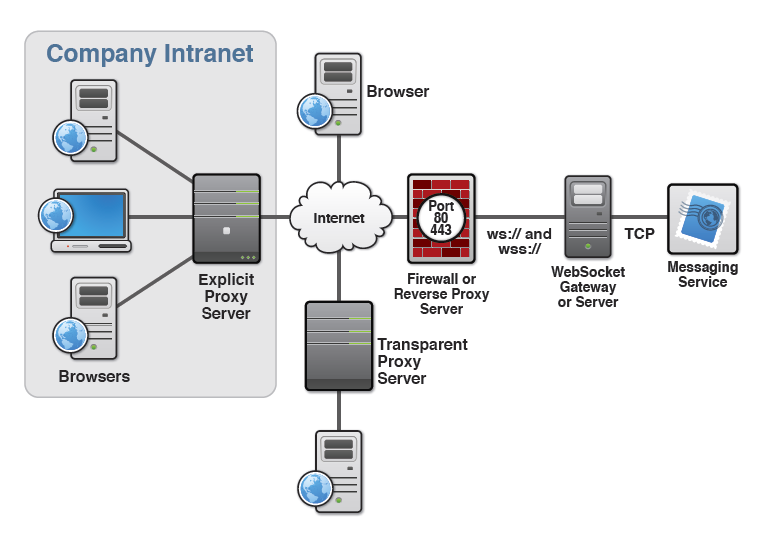
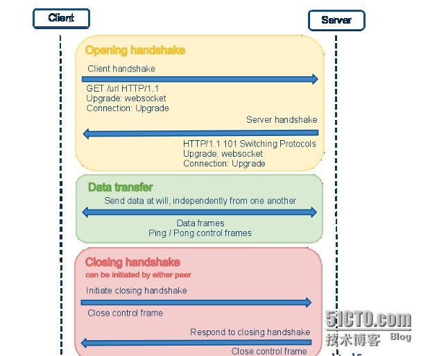
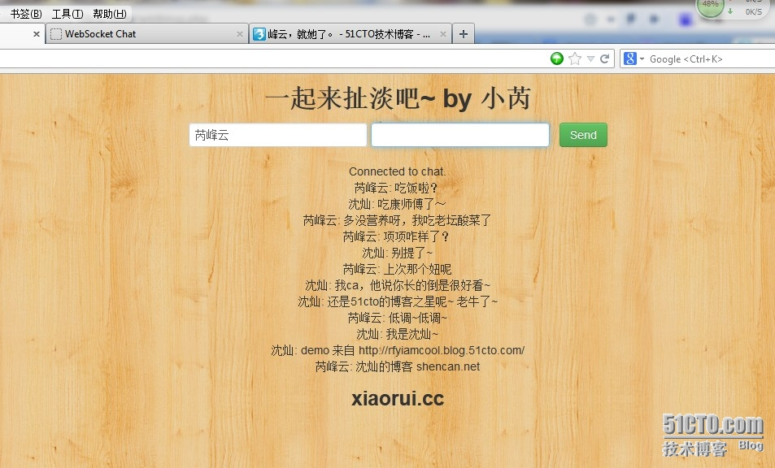
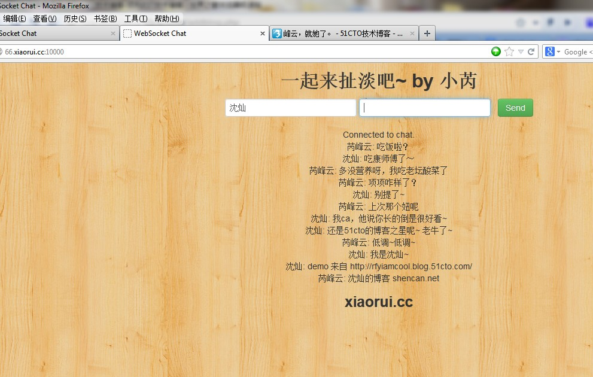

# 通过 python 和 websocket 构建实时通信系统[扩展 saltstack 监控]

先放一个小 demo~  

用 html5 的 websocket 实现的聊天平台。后端用的是 python bottle 框架。  

后期要改成监控，可能要联合 saltstack 做实时的监控。 
 
像上篇博客说的那样，实时监控就那点东西，就是接收数据、显示数据 。

像下面这样：

原文地址：<http://rfyiamcool.blog.51cto.com/1030776/1269232>

 

WebSocket API 是下一代客户端-服务器的异步通信方法。该通信取代了单个的 TCP 套接字，使用 ws 或 wss 协议，可用于任意的客户端和服务器程序。

WebSocket 目前由 W3C 进行标准化。WebSocket 已经受到 Firefox 4、Chrome 、Opera 10.70 以及 Safari 5 等浏览器的支持。

WebSocket API最伟大之处在于服务器和客户端可以在给定的时间范围内的任意时刻，相互推送信息。WebSocket 并不限于以 Ajax(或 XHR)方式通信，因为 Ajax 技术需要客户端发起请求，而 WebSocket 服务器和客户端可以彼此相互推送信息；XHR 受到域的限制，而 WebSocket 允许跨域通信。

**WebSocket 的优点**

a)、服务器与客户端之间交换的标头信息很小，大概只有 2 字节;

b)、客户端与服务器都可以主动传送数据给对方;

c)、不用频率创建 TCP 请求及销毁请求，减少网络带宽资源的占用，同时也节省服务器资源;

```
建立连接的握手  
当 Web 应用程序调用 new WebSocket(url)接口时，Browser 就开始了与地址为 url 的 WebServer 建立握手连接的过程。
1. Browser 与 WebSocket 服务器通过 TCP 三次握手建立连接，如果这个建立连接失败，那么后面的过程就不会执行，Web应用程序将收到错误消息通知。
2. 在 TCP 建立连接成功后，Browser/UA 通过 http 协议传送 WebSocket 支持的版本号，协议的字版本号，原始地址，主机地址等等一些列字段给服务器端。
3. WebSocket 服务器收到 Browser/UA 发送来的握手请求后，如果数据包数据和格式正确，客户端和服务器端的协议版本号匹配等等，就接受本次握手连接，并给出相应的数据回复，同样回复的数据包也是采用 http 协议传输。
4. Browser 收到服务器回复的数据包后，如果数据包内容、格式都没有问题的话，就表示本次连接成功，触发 onopen 消息，此时 Web 开发者就可以在此时通过 send 接口想服务器发送数据。否则，握手连接失败，Web 应用程序会收到 onerror 消息，并且能知道连接失败的原因。
这个握手很像 HTTP，但是实际上却不是，它允许服务器以 HTTP 的方式解释一部分 handshake 的请求，然后切换为 websocket
数据传输
WebScoket 协议中，数据以帧序列的形式传输。
考虑到数据安全性，客户端向服务器传输的数据帧必须进行掩码处理。服务器若接收到未经过掩码处理的数据帧，则必须主动关闭连接。
服务器向客户端传输的数据帧一定不能进行掩码处理。客户端若接收到经过掩码处理的数据帧，则必须主动关闭连接。
针对上情况，发现错误的一方可向对方发送 close 帧(状态码是 1002，表示协议错误)，以关闭连接。
```

 

ws的连接状态：

```
GET /chat HTTP/1.1
Upgrade: WebSocket
Connection: Upgrade
Host: 66.xiaorui.cc:10000
Origin: http://66.xiaorui.cc
Cookie: somenterCookie
```

## 简单了解下接口方法和属性：

readyState 表示连接有四种状态： 
 
- CONNECTING (0)：表示还没建立连接；
- OPEN (1)： 已经建立连接，可以进行通讯；
- CLOSING (2)：通过关闭握手，正在关闭连接；
- CLOSED (3)：连接已经关闭或无法打开；

url 是代表 WebSocket 服务器的网络地址，协议通常是”ws”或“wss(加密通信)”,send 方法就是发送数据到服务器端；

close 方法就是关闭连接；  
onopen 连接建立，即握手成功触发的事件；  
onmessage 收到服务器消息时触发的事件；  
onerror 异常触发的事件；  
onclose 关闭连接触发的事件；  

来个例子，咱们用 js 来搞搞

```
var wsServer = 'ws://localhost:8888/Demo'; //服务器地址
var websocket = new WebSocket(wsServer); //创建 WebSocket 对象
websocket.send("hello");//向服务器发送消息
alert(websocket.readyState);//查看 websocket 当前状态
websocket.onopen = function (evt) {
    //已经建立连接
};
websocket.onclose = function (evt) {
    //已经关闭连接
};
websocket.onmessage = function (evt) {
    //收到服务器消息，使用 evt.data 提取
};
websocket.onerror = function (evt) {
    //产生异常
};
```

我的后端代码：

python 的后端实现 websocket 的处理，有很多方法的。

比较常见的是 gevent 的 websocket 的方式。

```
from bottle import get, run, template
from bottle.ext.websocket import GeventWebSocketServer
from bottle.ext.websocket import websocket
import gevent
users = set()
@get('/')
def index():
    return template('index')
@get('/websocket', apply=[websocket])
def chat(ws):
    users.add(ws)
    while True:
        msg = ws.receive()
        if msg is not None:
            for u in users:
                print type(u)
                u.send(msg)
                print u,msg
        else: break
    users.remove(ws)
run(host='10.10.10.66', port=10000, server=GeventWebSocketServer)
```

后端的东西比较的简单，就是把接收到的数据，原路打回去。。。

我前端的代码

这个是连接 webscoket，然后接收和发数据的 js

```
<script>
        $(document).ready(function() {
            if (!window.WebSocket) {
                if (window.MozWebSocket) {
                    window.WebSocket = window.MozWebSocket;
                } else {
                    $('#messages').append("<li>Your browser doesn't support WebSockets.</li>");
                }
            }
            ws = new WebSocket('ws://10.10.10.66:10000/websocket');
            ws.onopen = function(evt) {
                $('#messages').append('<li>Connected to chat.</li>');
            }
            ws.onmessage = function(evt) {
                $('#messages').append('<li>' + evt.data + '</li>');
            }
            $('#send-message').submit(function() {
                ws.send($('#name').val() + ": " + $('#message').val());
                $('#message').val('').focus();
                return false;
            });
        });
    </script>
```

用来呈现结果的 div

```
form id="send-message" class="form-inline">
        <input id="name" type="text" value="可以更换名字">
        <input id="message" type="text" value="要扯淡的内容" />
       &nbsp; <button class="btn btn-success" type="submit">Send</button>
    </form>
    <div id="messages"></div>
```

这里有个 tornado 后端的代码，实现的过程和我差不多的~我需要的朋友可以跑一下~

```
import logging
import os.path
import uuid
import tornado.httpserver
import tornado.ioloop
import tornado.options
import tornado.web
import tornado.websocket
def send_message(message):
    for handler in ChatSocketHandler.socket_handlers:
        try:
            handler.write_message(message)
        except:
            logging.error('Error sending message', exc_info=True)
class MainHandler(tornado.web.RequestHandler):
    def get(self):
        self.render('index.html')
class ChatSocketHandler(tornado.websocket.WebSocketHandler):
    socket_handlers = set()
    def open(self):
        ChatSocketHandler.socket_handlers.add(self)
        send_message('A new user has entered the chat room.')
    def on_close(self):
        ChatSocketHandler.socket_handlers.remove(self)
        send_message('A user has left the chat room.')
    def on_message(self, message):
        send_message(message)
def main():
    settings = {
        'template_path': os.path.join(os.path.dirname(__file__), 'templates'),
        'static_path': os.path.join(os.path.dirname(__file__), 'static')
    }
    application = tornado.web.Application([
        ('/', MainHandler),
        ('/new-msg/', ChatHandler),
        ('/new-msg/socket', ChatSocketHandler)
    ], **settings)
    http_server = tornado.httpserver.HTTPServer(application)
    http_server.listen(8000)
    tornado.ioloop.IOLoop.instance().start()
if __name__ == '__main__':
    main()
```

我和沈灿的对话~

 

沈灿和我的对话

 

本文出自 “峰云，就她了。” 博客，谢绝转载！