# Mongodb 千万级数据在 python 下的综合压力测试及应用探讨

曾经在收集数据的项目中，用过 mongodb 的数据存储，但是当数据很大的时候，还是比较的吃力。很可能当时的应用水平不高，也可以是当时的服务器不是很强。 所以这次能力比以前高点了，然后服务器比以前也高端了很多，好嘞 ~再测试下。  
（更多的是单机测试，没有用复制分片的测试 ～）！

相比较 MySQL，**MongoDB 数据库更适合那些读作业较重的任务模型**。MongoDB 能充分利用机器的内存资源。如果机器的内存资源丰富的话，MongoDB 的查询效率会快很多。

这次测试的服务器是 dell 的 r510！

 

内存还行，是 48 G 的，本来想让同事给加满，但是最终还是没有说出口 ~  

 

磁盘是 10 个 2T 的，但是因为格式化的时间太久了，哥们直接把其他的硬盘给拔出来了，就用了三个盘。。。data 目录没有做 raid，是为了让他们体现更好的硬盘速度。

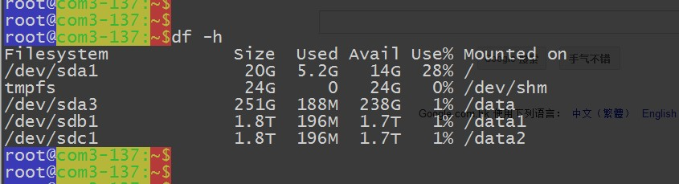 

既然说好了是在 python 下的应用测试，那就需要安装 mongodb python 下的模块！
对了，不知道 mongodb-server 的安装要不要说下？

```
cat /etc/yum.repos.d/10.repo
[10gen]
name=10gen Repository
baseurl=http://downloads-distro.mongodb.org/repo/redhat/os/x86_64
gpgcheck=0
```

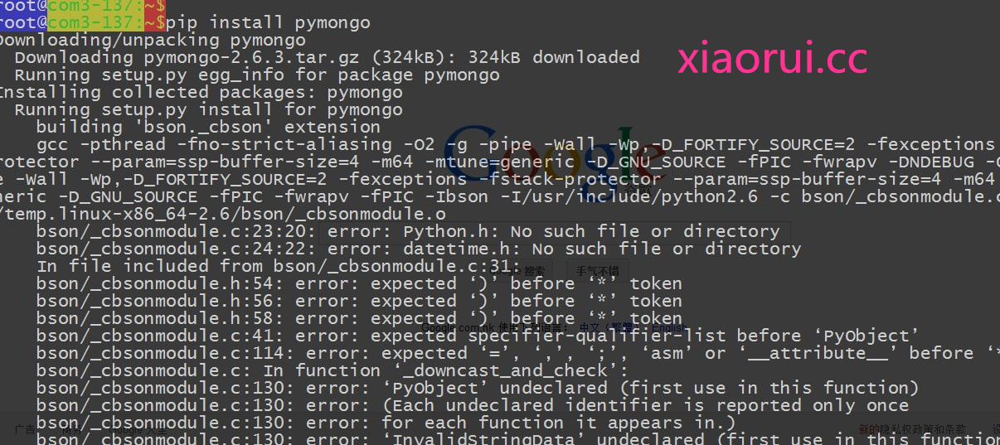 

Pymongo 的基本用法

```
from pymongo import * # 导包
con = Connection(...) # 链接
db = con.database # 链接数据库
db.authenticate('username', 'password') # 登录
db.drop_collection('users') #删除表
db.logout() # 退出
db.collection_names() # 查看所有表
db.users.count() # 查询数量
db.users.find_one({'name' : 'xiaoming'}) # 单个对象
db.users.find({'age' : 18}) # 所有对象
db.users.find({'id':64}, {'age':1,'_id':0}) # 返回一些字段 默认_id总是返回的 0不返回 1返回
db.users.find({}).sort({'age': 1}) # 排序
db.users.find({}).skip(2).limit(5) # 切片
```

测试的代码：

```
#!/usr/bin/env python
from pymongo import Connection
import time,datetime
import os,sys
connection = Connection('127.0.0.1', 27017)
db = connection['xiaorui']
def func_time(func):
    def _wrapper(*args,**kwargs):
        start = time.time()
        func(*args,**kwargs)
        print func.__name__,'run:',time.time()-start
    return _wrapper
@func_time
def ainsert(num):
    posts = db.userinfo
    for x in range(num):
        post = {"_id" : str(x),
        "author": str(x)+"Mike",
        "text": "My first blog post!",
        "tags": ["xiaorui", "xiaorui.cc", "rfyiamcool.51cto"],
        "date": datetime.datetime.utcnow()}
        posts.insert(post)
if __name__ == "__main__":
    num = sys.argv[1]
    ainsert(int(num))
```

咱们就先来个百万的数据做做测试~

综合点的数据：

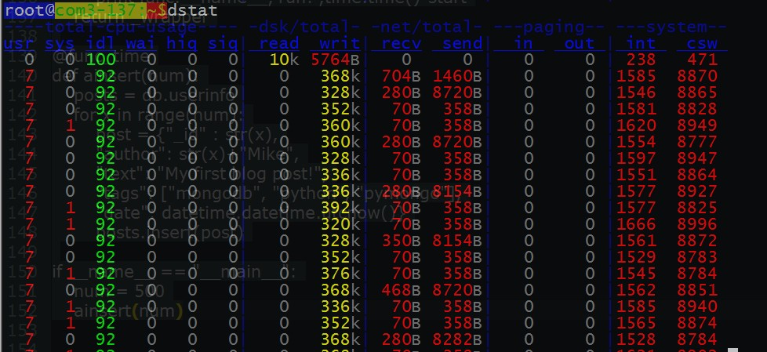 

在 top 下看到的程序占用资源的情况 ~ 我们看到的是有两个进程的很突出，对头 ！ 正是 mongodb 的服务和我们正在跑的 python 脚本！

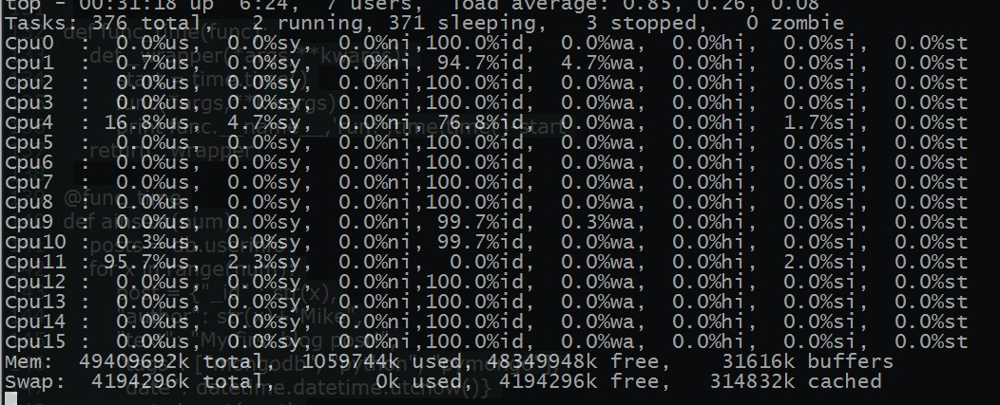 

看下服务的 io 的情况 ~

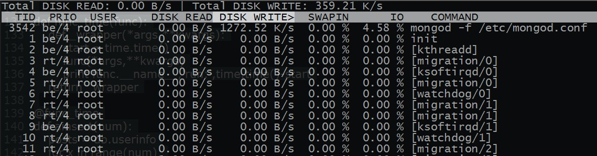 

脚本运行完毕，总结下运行的时间 ~

 

查看 mongodb 的状态~  
他的 insert 也不到 5k ~ 插入量也就 800k 左右 ~  
它的输出有以下几列：

inserts/s 每秒插入次数  
query/s 每秒查询次数  
update/s 每秒更新次数  
delete/s 每秒删除次数  
getmore/s 每秒执行 getmore 次数  
command/s 每秒的命令数，比以上插入、查找、更新、删除的综合还多，还统计了别的命令  
flushs/s 每秒执行 fsync 将数据写入硬盘的次数。  
mapped/s 所有的被 mmap 的数据量，单位是 MB，  
vsize 虚拟内存使用量，单位 MB  
res 物理内存使用量，单位 MB  
faults/s 每秒访问失败数（只有 Linux 有），数据被交换出物理内存，放到 swap。不要超过 100，否则就是机器内存太小，造成频繁 swap 写入。此时要升级内存或者扩展  
locked % 被锁的时间百分比，尽量控制在 50% 以下吧    
idx miss % 索引不命中所占百分比。如果太高的话就要考虑索引是不是少了    
q t|r|w 当 Mongodb 接收到太多的命令而数据库被锁住无法执行完成，它会将命令加入队列。这一栏显示了总共、读、写 3 个队列的长度，都为 0 的话表示 mongo 毫无压力。高并发时，一般队列值会升高。  
conn 当前连接数  
time 时间戳  

瞅下面的监控数据！
  
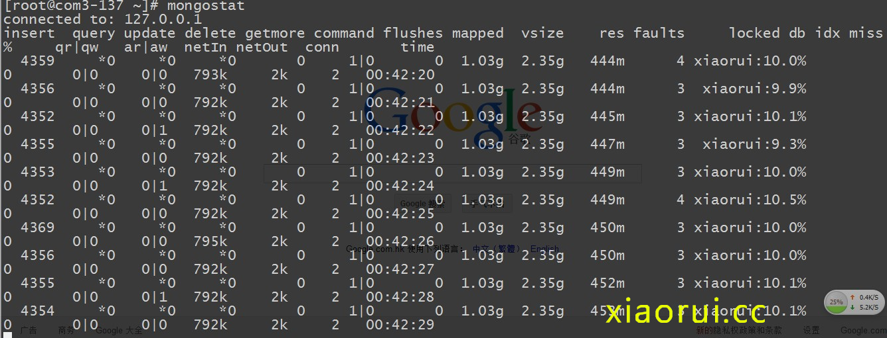 

然后我们在测试下在一千万的数据下的消耗时间情况 ~

共用了 2294 秒，每秒插入 4359 个数据 ~

 

看看他的内存的使用情况：

虚拟内存在 8 gb 左右，真实内存在 2 gb 左右

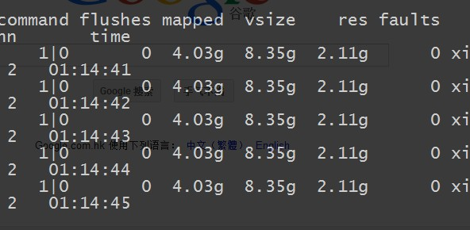 

再换成多线程的模式跑跑 ~  个人不太喜欢用多线程，这东西属于管你忙不忙，老大说了要公平，我就算抢到了，但是没事干，我也不让给你。。。属于那种蛮干的机制 ~

nima，要比单个跑的慢呀 ~  线程这东西咋会这么不靠谱呀 ~  
应该是没有做线程池 pool，拉取队列。导致线程过多导致的。不然不可能比单进程都要慢~  
还有就是像这些涉及到 IO 的东西，交给协程的事件框架更加合理点 ！！！  

```
def goodinsert(a):
    posts.insert(a)
def ainsert(num):
    for x in range(num):
        post = {"_id" : str(x),
        "author": str(x)+"Mike",
        "text": "My first blog post!",
        "tags": ["mongodb", "python", "pymongo"],
        "date": datetime.datetime.utcnow()}
#       goodinsert(post)
        a=threading.Thread(target=goodinsert,args=(post,))
        a.start()
```

 

python 毕竟有 gil 的限制，虽然 multiprocess 号称可以解决多进程的。但是用过的朋友知道，这个东西更不靠谱 ~  属于坑人的东西 ~

要是有朋友怀疑是 python 的单进程的性能问题，那咱们就用 supervisord 跑了几个后台的 python 压力脚本 ~ supervisord 的配置我就不说了，我以前的文章里面有详述的 ~

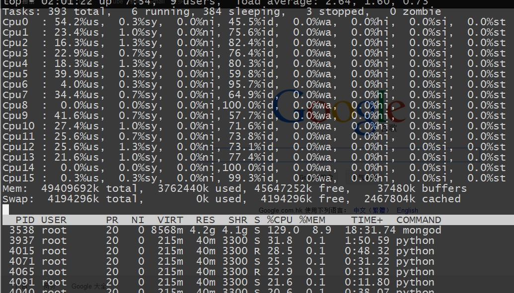 

cpu 方面是跑的有点均匀了，但是 mongodb 那边的压力总是上不去  
当加大到 16 个后台进程做压力测试的时候 ~ 大家会发现 insert 很不稳定。 看来他的极限也就是 2 MB 左右的数据 ~  

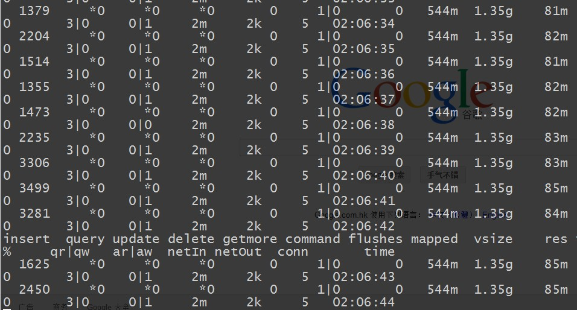 

当减少到 8 个压力进程的时候 ~ 我们发现他的 insert 慢慢的提供到正常了，也就是说  他真的是 2 MB 的极限 ~  

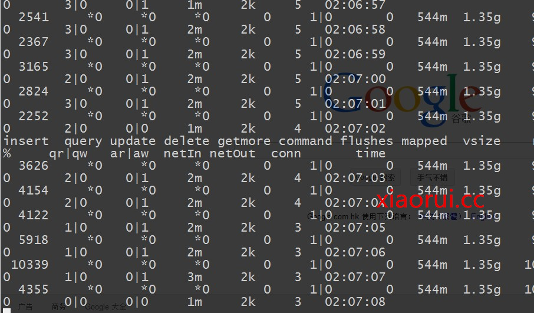 

脚本里面是有做有序的 id 插入的，我们试试把 id 的插入给去掉，看看有没有提升~  
结果和不插入 id 差不多的结果 ~    

 

调优之后～ 再度测试  

ulimit 的优化  

```
cat /etc/security/limits.conf
*       soft   nofile       102400
*       hard   nofile       102400
```

内核的 tcp 优化

```
cat /etc/sysctl.conf
net.ipv4.tcp_syncookies = 1
net.ipv4.tcp_tw_reuse = 1
net.ipv4.tcp_tw_recycle = 1
net.ipv4.tcp_timestsmps = 0
net.ipv4.tcp_synack_retries = 2
net.ipv4.tcp_syn_retries = 2
net.ipv4.tcp_wmem = 8192 436600 873200
net.ipv4.tcp_rmem = 32768 436600 873200
net.ipv4.tcp_mem = 94500000 91500000 92700000
net.ipv4.tcp_max_orphans = 3276800
net.ipv4.tcp_fin_timeout = 30
#直接生效
/sbin/sysctl -p
```

启动的时候，加上多核的优化参数

```
多核问题可以在启动时加入启动参数： numactl --interleave=all
```

insert 的频率已经到了 2 w 左右 ～  内存占用了 8 G 左右 ～

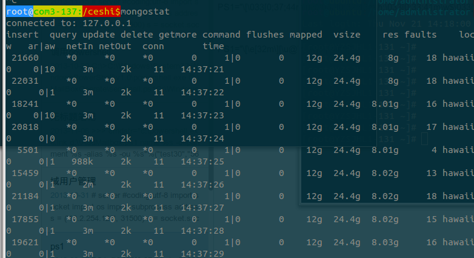 

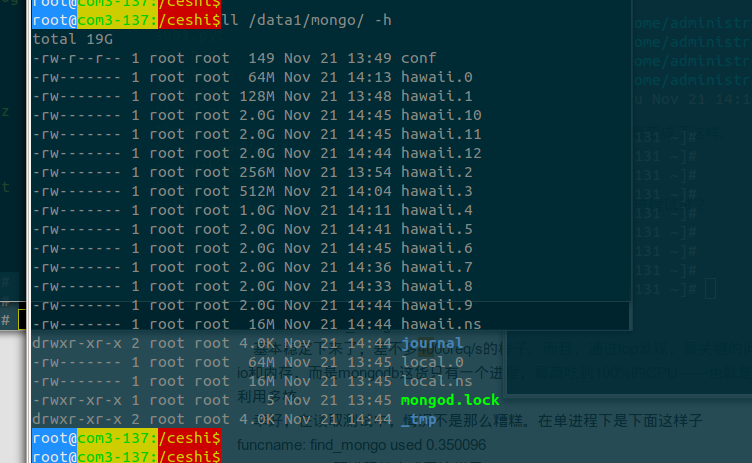 

我想到的一个方案：

当然不用非要 celery，就算咱们用 socket 写分发，和 zeromq 的 pub sub 也可以实现这些的。这是 celery 的调度更加专业点。

 

刚才我们测试的都是insert，现在我们再来测试下在千万级别数据量下的查询如何：

查询正则的，以2开头的字符

```
posts = db.userinfo
for i in posts.find({"author":re.compile('^2.Mike')}):
    print i
```

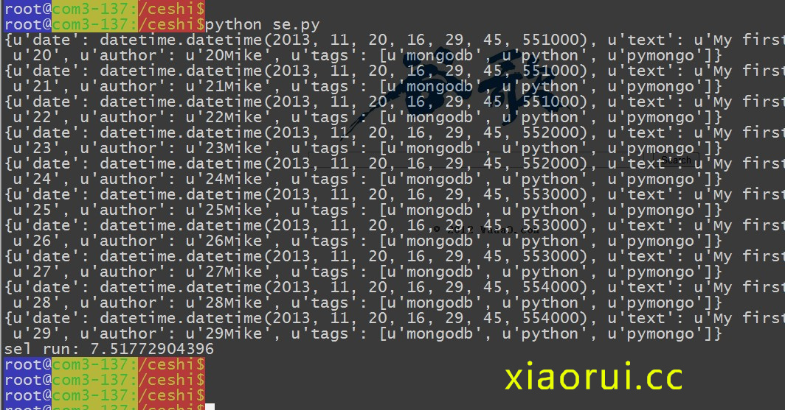 

精确的查询：

查询在 5s 左右 ~

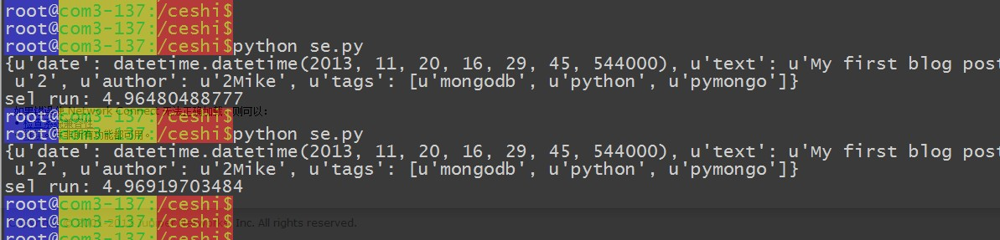 

 

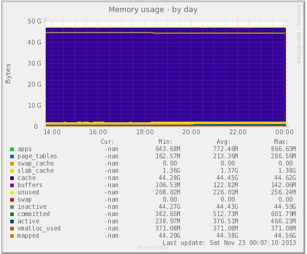 

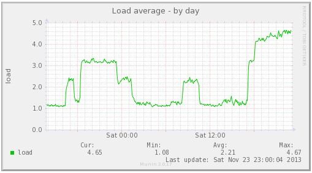 

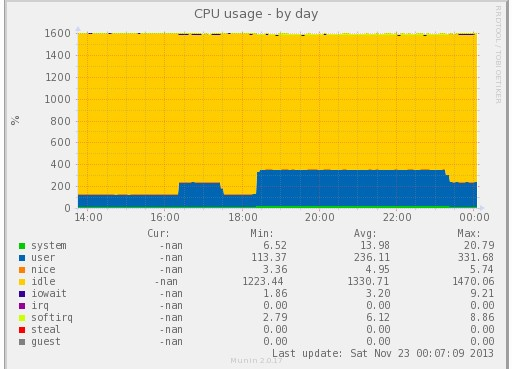 

总结：

典型的高读低写数据库！

本文出自 “峰云，就她了。” 博客，谢绝转载！