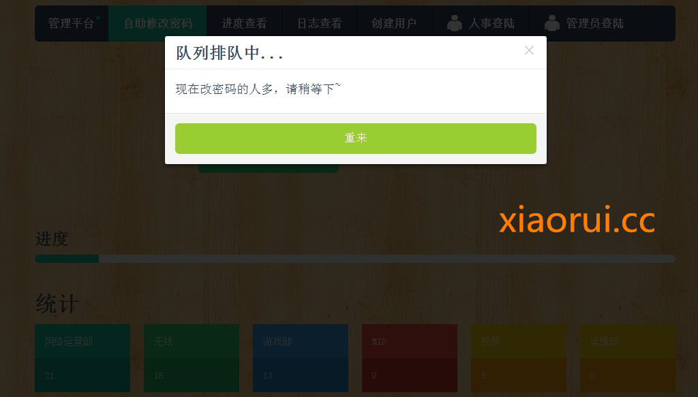
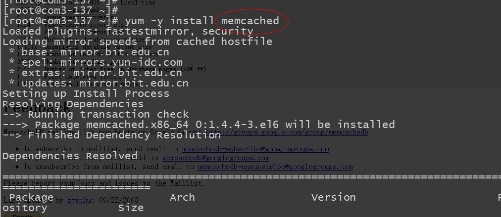
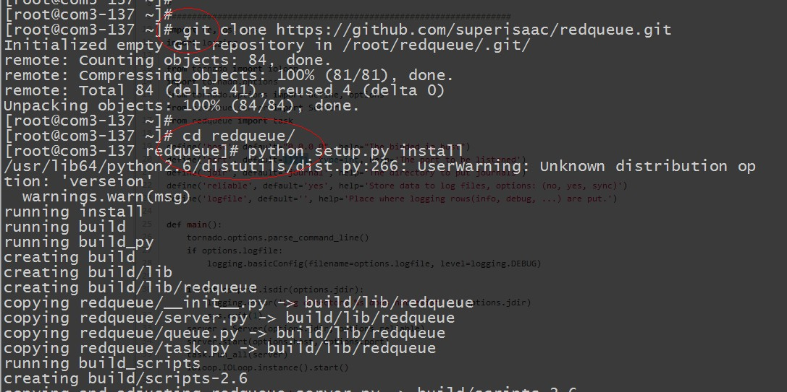
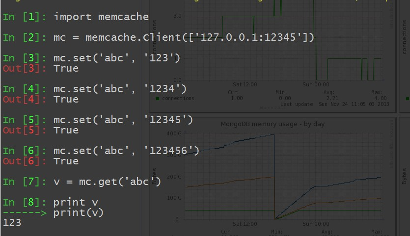

# 通过 memcached 实现领号排队功能及 python 队列实例

## 前言：

前段时间写的那个域用户平台，要做大量的新功能运维测试，据说要抄 IT 组，让那帮人到搞，跑一下！ 尼玛，这可吓坏了我了。 因为平台要和 windows 做大量的交互，那边 powershell 又很不给力，改成多线程版本后，出现莫名的问题，很让人闹心。现在的状态是，client 给 server 端可以同时推送两片信息，要是多的话，powershell 实在处理不了，我只能放到 queue 队列里面了。

现在很多的堵塞都是在 windows 那边，我这边因为用的是 tornado，对于用户访问是无压力的，但是 windows 那边不能同时运行多了，不然会提示 bug。。。 
 
ad 的信息我暂时还没有批量的同步过来，所以只能单点搞了 ~  

一直在想咋才能不出丑。所以做了好多的限制，比如短信接口的 token 机制，用户更新接口的次数的限制。 现在唯一的节点就是和 win 那边的交互。别等到了周一的时候，一帮人把 获取手机号码、修改密码、更新用户信息的接口给点爆了。

突然想到 12306 那个渣渣，可以用排队呀。。。 这样的话，最少能看起来很高端的样子。

 

我的前端实现 ~

用户点击的时候，我会从后端的 api 查看队列中的数目，以及有谁排在我的前面 ~

```
        $("#dialog").hide();
        $("#mailname").focus();
        $("#service").click(function(){
                    $.ajax({
                     type: "POST",
                     url: "/queue",
                     data : $("#form_service").serialize(),
                     dataType: "html",
                      timeout:5000,
                     error: function(){
                          alert('nima，超时了');
                     },
                     success: function(data,status){
                        if( data=="ok"){
                          <!--  alert (data+status+"成功了");-->
                            var a=$("input[name=mailname]").val();
                            window.location.href="/mailpost?mailname="+a; }
                        else{
                             $('#myModal').modal();
                            }
                        }
                    });
        });
});
```

后端的实现~

不用 redis 做队列的原因是，python 调用队列的时候总是莫名的关闭，卸载安装了好多遍。。。怪事 ~  和 powershell 多线程一样都很怪~

安装配置 memcached 环境，简单点直接 yum ~

需要编译安装的朋友，用下面的脚本~

```
wget https://github.com/downloads/libevent/libevent/libevent-2.0.21-stable.tar.gz
tar xzf libevent-2.0.21-stable.tar.gz
cd libevent-2.0.21-stable
./configure
make
make install
wget http://memcached.googlecode.com/files/memcached-1.4.15.tar.gz
tar vxzf memcached-1.4.15.tar.gz
cd memcached-1.4.15
./configure --prefix=/usr/local/webserver/memcached
make
make install
```

 

启动 memcached 命令是：  /usr/local/memcached/bin/memcached -d -m 100 -c 1000 -u root -p 11211

```
-d 选项是启动一个守护进程
-m 是分配给 Memcache 使用的内存数量，单位是 MB，默认 64 MB
-M return error on memory exhausted (rather than removing items)
-u 是运行 Memcache 的用户，如果当前为 root 的话，需要使用此参数指定用户
-l 是监听的服务器 IP 地址，默认为所有网卡
-p 是设置 Memcache 的 TCP 监听的端口，最好是 1024 以上的端口
-c 选项是最大运行的并发连接数，默认是 1024
-P 是设置保存 Memcache 的 pid 文件
-f chunk size growth factor (default: 1.25)
-I Override the size of each slab page. Adjusts max item size(1.4.2 版本新增)
```

有朋友可能没有接触过 memcached，也有没有用 python 操作 memcached 的。 我在这里就简单操作下，让大家瞅瞅哈~

python 操作 memcached 需要安装 python-memcached 模块

pip install python-memcached

```
import memcache
 mc=memcache.Client(['127.0.0.1:11211'],debug=0)
 mc.set(“xiaorui.cc”,”fengyun”)
 value=mc.get(“xiaorui.cc”)
 mc.set(“another_key”,3)
 mc.delete(“another_key)
 mc.set(“key”,”1″) #用于自动增量/减量的必须是字符串
 mc.incr(“key”)
 mc.decr(“key”)
 标准的使用 memcache 作为数据库缓存的方法如下:
 key=derive_key(obj)
 obj=mc.get(key)
 if not obj:
 obj=backend_api.get(…)
 mc.set(obj)
 #现在可以操作 obj
```

构造函数    
delete(key,time=0)    
删除某个键。time 的单位是秒，确保特定时间内的 set/update 操作会失败。返回 1 成功，0 失败。  
incr(key,delta=1)    
给自增量变量加上 delta，默认为 1。  
decr(key,delta=1)  
给自减量变量减去 delta，默认为 1。  
add(key,val,time=0,min_compress_len=0)  
添加一个键值对，内部调用 _set() 方法。    
replace(key,val,time=0,min_compress_len=0)  
替换值，内部调用_set() 方法。  
set(key,val,time=0,min_compress_len=0)  
无条件的设置键值对。time 设置超时，单位是秒。min_compress_len 用于设置 zlib 压缩。内部调用_set() 方法。  
set_multi(mapping,time=0,key_prefix=”,min_compress_len=0)  
设置多个键值对。  
get(key)  
获取值。出错则返回 None。  
get_multi(keys,key_prefix=”)  
获取多个键的值，返回字典。keys 为健明列表。key_prefix 是键名前缀，可以最终构成 key_prefix+key 的完整键名。与 set_multi 中一样。  

Memcached 本身没有的实现的，但是高手还是多呀，有个高手开源了一个 memcached 队列的 python 实现方案。

RedQueue 参考了 github 开源项目 starling(ruby 写的)， twitter 曾经使用伊做队列服务，后来改成了用 scala 写的 scaling(kestrol) . Redqueue 用 python 的高性能框架 tornado 写成。支持 memcache 协议, 也就是说伪装成一个 memcache server，由于许多语言都有了 memcache 库，也就有了应用 redqueue 的土壤。
 
redqueue 是可以持久化的，使用日志文件记录所有的操作，当系统重启的时候，可以恢复没有处理的未超时任务重新处理。 这样对于 server 端的容错性有好处。更进一步的是，redqueue 具有客户端容错性，客户通过 get 命令从队列中得到一个任务，使用 delete 删除这个任务，如果没有 delete 而因某种原因退出了，则该任务会被 server 重新塞入队列等待处理。

 

关于 redqueue 的 python 应用小 demo ~

```
# 引入 memcache 模块
import memcache
#初始化客户端
mc = memcache.Client(['127.0.0.1:12345'])  # 假设 redqueue server 守候在 localhost 的 12345 端口
# 发布一个项目到 key myqueue 中, 值为"Hello world"
mc.set("xiaorui", "good")
                                                                                                                                                                                                                                                                                                                                                                                                                                                                                                
# 消费者从 queue server 中取出一个任务， 并打印
print mc.get("xiaorui")  # 应该是 good
                                                                                                                                                                                                                                                                                                                                                                                                                                                                                                
# 删除一个任务，必须做，否则 server 会认为客户端异常发生了，而重新队列处理该任务
# 什么时候客户端确认该任务已经确保执行了，就可以 delete 掉。在这之间，任务不会被其他客户端执行。
mc.delete("xiaorui")
```

 

这个是作者给的过程：

```
== Install and Run
 Install tornado and (optional) python-memcached for client testing
                                                                                                                                                                                                                                                                                                                                                                    
 Get the source from
 git@github.com:superisaac/redqueue.git
                                                                                                                                                                                                                                                                                                                                                                    
 Install
 % python setup.py install
 Make the log dir
 % mkdir -p log
 Run the server
 % redqueue_server.py
                                                                                                                                                                                                                                                                                                                                                                    
 For more options please run
 % redqueue_server.py --help
== Reserve/delete mode
   Reserve/delete mode is currently the sole mode, once an item is fetched, a delete request must be send later to mark the item is used, or else the item will be recycled back later.
   >>> mc.set('abc', '123')
   >>> v = mc.get('abc')
   >>> if v is not None:
   >>>     mc.delete('abc')
```

现在队列有了，我给大家说下，我那边是咋实现排队的~

当用户访问页面下一步的时候，我会判断队列，要是他前面有人在进行，我会给他重定向到最初的页面。当别人搞完了，他才可以的。

但是这样的话，还有个问题，那就是要是有 5 个人同时进了队列里面了，我给他们已经排序了，要是老大和老二，他不在进行了，老三的话，咋办。。。  这时候就需要配置队列里面的值和 kv 的一个值做时间的生效。  也就是说  老大和老二要是在指定的时间内没有完成的话，我会把他们踢出去，这样老三就成老大了。

本文出自 “峰云，就她了。” 博客，谢绝转载！