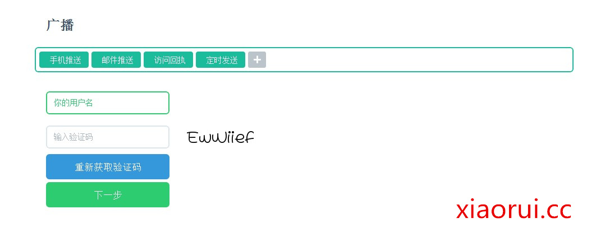
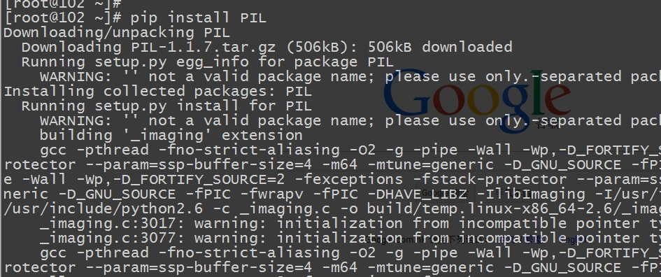
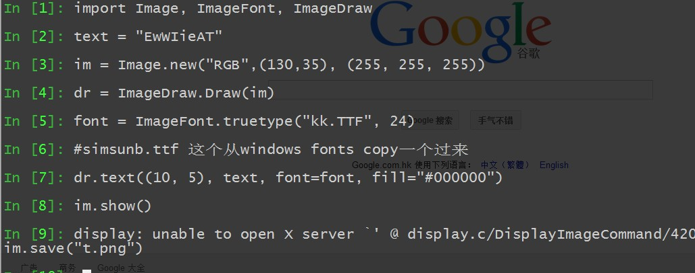
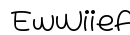
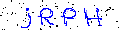
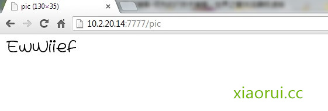

# python 之利用 PIL 库实现页面的图片验证码及缩略图

## 前言：

在域用户平台里面集成了一个信使的功能，但是怕别人无脑的乱发，又怕别人乱调用接口，加了一个图片验证码的功能~  

实现起来比较简单，用 python 的 PIL 库就可以实现了。



```
yum install -y libjpeg-devel
yum install freetype-*
```

安装 pil 库 ~



能不能用，要看下面是否支持 jpeg，不然图片没法写入的


好嘞，咱们可以跑一个 demo 了~

```
import Image, ImageFont, ImageDraw
text = "EwWIieAT"
im = Image.new("RGB",(130,35), (255, 255, 255))
dr = ImageDraw.Draw(im)
font = ImageFont.truetype("kk.TTF", 24)
#simsunb.ttf 这个从windows fonts copy一个过来
dr.text((10, 5), text, font=font, fill="#000000")
im.show()
im.save("t.png")
```



因为用的是终端，没法看，传到 windows 上，看下结果~



PIL 可以做很多的事情，比如缩略图的实现~

```
from PIL import Image
img = Image.open('god.jpg')
img = img.resize((250, 156), Image.ANTIALIAS)
img.save('sharejs_small.jpg')
```


对于验证码来说，上面的有点太正派了，很容易被破解了，所以咱们把验证码的图片给伪装下。

```
#!/usr/bin/env python
#coding=utf-8
import random
from PIL import Image, ImageDraw, ImageFont, ImageFilter
_letter_cases = "abcdefghjkmnpqrstuvwxy" # 小写字母，去除可能干扰的 i，l，o，z
_upper_cases = _letter_cases.upper() # 大写字母
_numbers = ''.join(map(str, range(3, 10))) # 数字
init_chars = ''.join((_letter_cases, _upper_cases, _numbers))
def create_validate_code(size=(120, 30),
                         chars=init_chars,
                         img_type="GIF",
                         mode="RGB",
                         bg_color=(255, 255, 255),
                         fg_color=(0, 0, 255),
                         font_size=18,
                         font_type="kk.TTF",
                         length=4,
                         draw_lines=True,
                         n_line=(1, 2),
                         draw_points=True,
                         point_chance = 2):
    '''
    @todo: 生成验证码图片
    @param size: 图片的大小，格式（宽，高），默认为(120, 30)
    @param chars: 允许的字符集合，格式字符串
    @param img_type: 图片保存的格式，默认为 GIF，可选的为 GIF，JPEG，TIFF，PNG
    @param mode: 图片模式，默认为 RGB
    @param bg_color: 背景颜色，默认为白色
    @param fg_color: 前景色，验证码字符颜色，默认为蓝色#0000FF
    @param font_size: 验证码字体大小
    @param font_type: 验证码字体，默认为 ae_AlArabiya.ttf
    @param length: 验证码字符个数
    @param draw_lines: 是否划干扰线
    @param n_lines: 干扰线的条数范围，格式元组，默认为(1, 2)，只有 draw_lines 为 True 时有效
    @param draw_points: 是否画干扰点
    @param point_chance: 干扰点出现的概率，大小范围[0, 100]
    @return: [0]: PIL Image 实例
    @return: [1]: 验证码图片中的字符串
    '''
    width, height = size # 宽， 高
    img = Image.new(mode, size, bg_color) # 创建图形
    draw = ImageDraw.Draw(img) # 创建画笔
    def get_chars():
        '''生成给定长度的字符串，返回列表格式'''
        return random.sample(chars, length)
    def create_lines():
        '''绘制干扰线'''
        line_num = random.randint(*n_line) # 干扰线条数
        for i in range(line_num):
            # 起始点
            begin = (random.randint(0, size[0]), random.randint(0, size[1]))
            #结束点
            end = (random.randint(0, size[0]), random.randint(0, size[1]))
            draw.line([begin, end], fill=(0, 0, 0))
    def create_points():
        '''绘制干扰点'''
        chance = min(100, max(0, int(point_chance))) # 大小限制在[0, 100]
                                                                                                 
        for w in xrange(width):
            for h in xrange(height):
                tmp = random.randint(0, 100)
                if tmp > 100 - chance:
                    draw.point((w, h), fill=(0, 0, 0))
    def create_strs():
        '''绘制验证码字符'''
        c_chars = get_chars()
        strs = ' %s ' % ' '.join(c_chars) # 每个字符前后以空格隔开
                                                                                                 
        font = ImageFont.truetype(font_type, font_size)
        font_width, font_height = font.getsize(strs)
        draw.text(((width - font_width) / 3, (height - font_height) / 3),
                    strs, font=font, fill=fg_color)
                                                                                                 
        return ''.join(c_chars)
    if draw_lines:
        create_lines()
    if draw_points:
        create_points()
    strs = create_strs()
    # 图形扭曲参数
    params = [1 - float(random.randint(1, 2)) / 100,
              0,
              0,
              0,
              1 - float(random.randint(1, 10)) / 100,
              float(random.randint(1, 2)) / 500,
              0.001,
              float(random.randint(1, 2)) / 500
              ]
    img = img.transform(size, Image.PERSPECTIVE, params) # 创建扭曲
    img = img.filter(ImageFilter.EDGE_ENHANCE_MORE) # 滤镜，边界加强（阈值更大）
    return img, strs
if __name__ == "__main__":
    code_img = create_validate_code()
    code_img[0].save("xiaorui.cc.gif", "GIF")
```

看下验证码效果 ~



要是在 web 框架里面的话，可以直接 return 一个验证码图片

比如：

tornado 的实现方式

```
output = StringIO()
im.save(output, 'JPEG', quality = 95)
img_data = output.getvalue()
output.close()
#在浏览器现实图片
set_header('Content-Type','image/jpeg')
write(img_data)
```

我这里用的是 flask，代码实现是

```
@app.route('/pic')
def showPic():
    import Image, ImageFont, ImageDraw
    import StringIO
    output = StringIO.StringIO()
    text = "EwWIieAT"
    im = Image.new("RGB",(130,35), (255, 255, 255))
    dr = ImageDraw.Draw(im)
    font = ImageFont.truetype("kk.TTF", 24)
    #simsunb.ttf 这个从windows fonts copy一个过来
    dr.text((10, 5), text, font=font, fill="#000000")
#    im.show()
    im.save(output,"GIF")
    img_data = output.getvalue()
    output.close()
    response = make_response(img_data)
    response.headers['Content-Type'] = 'image/gif'
    return response
```



本文出自 “峰云，就她了。” 博客，谢绝转载！