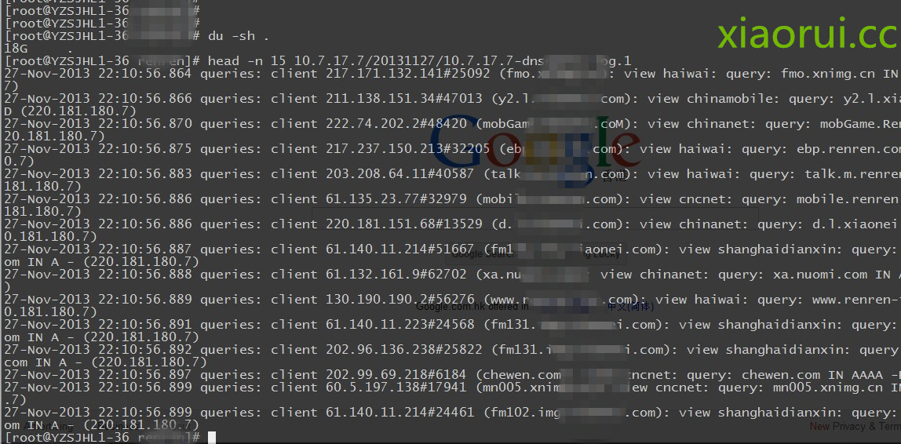
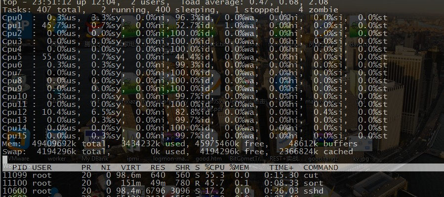
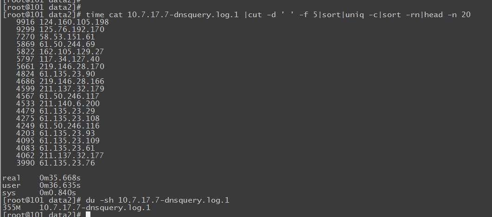
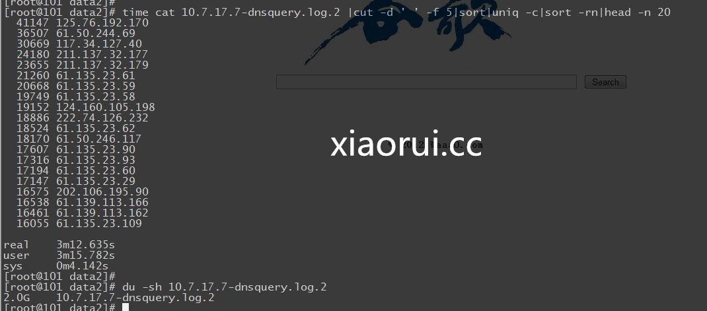
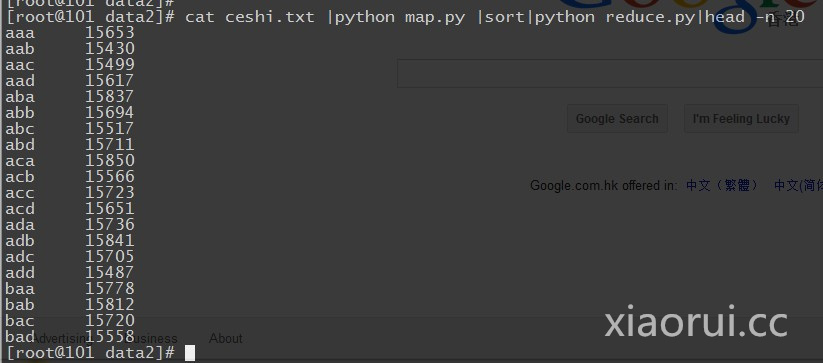
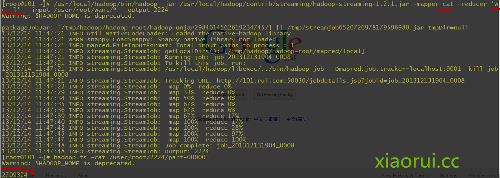
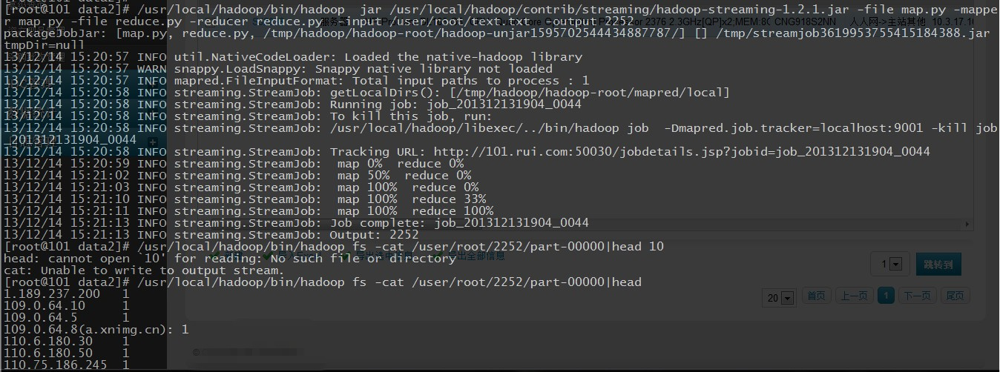

# 使用 python 构建基于 hadoop 的 mapreduce 日志分析平台


流量比较大的日志要是直接写入 Hadoop 对 Namenode 负载过大，所以入库前合并，可以把各个节点的日志凑并成一个文件写入 HDFS。 根据情况定期合成，写入到 hdfs 里面。

咱们看看日志的大小，200 G 的 dns 日志文件，我压缩到了 18 G，要是用 awk perl 当然也可以，但是处理速度肯定没有分布式那样的给力。



Hadoop Streaming 原理

mapper 和 reducer 会从标准输入中读取用户数据，一行一行处理后发送给标准输出。Streaming 工具会创建 MapReduce 作业，发送给各个 tasktracker，同时监控整个作业的执行过程。

任何语言，只要是方便接收标准输入输出就可以做 mapreduce~

再搞之前我们先简单测试下 shell 模拟 mapreduce 的性能速度~



看下他的结果，350 M 的文件用时 35 秒左右。



这是 2 G 的日志文件，居然用了 3 分钟。 当然和我写的脚本也有问题，我们是模拟 mapreduce 的方式，而不是调用 shell 下牛逼的 awk，gawk 处理。



awk 的速度！果然很霸道，处理日志的时候，我也很喜欢用 awk，只是学习的难度有点大，不像别的 shell 组件那么灵活简单。


这是官方的提供的两个 demo ~

map.py

```
#!/usr/bin/env python
"""A more advanced Mapper, using Python iterators and generators."""
import sys
def read_input(file):
    for line in file:
        # split the line into words
        yield line.split()
def main(separator='\t'):
    # input comes from STDIN (standard input)
    data = read_input(sys.stdin)
    for words in data:
        # write the results to STDOUT (standard output);
        # what we output here will be the input for the
        # Reduce step, i.e. the input for reducer.py
        #
        # tab-delimited; the trivial word count is 1
        for word in words:
            print '%s%s%d' % (word, separator, 1)
if __name__ == "__main__":
    main()
```

reduce.py 的修改方式

```
#!/usr/bin/env python
"""A more advanced Reducer, using Python iterators and generators."""
from itertools import groupby
from operator import itemgetter
import sys
def read_mapper_output(file, separator='\t'):
    for line in file:
        yield line.rstrip().split(separator, 1)
def main(separator='\t'):
    # input comes from STDIN (standard input)
    data = read_mapper_output(sys.stdin, separator=separator)
    # groupby groups multiple word-count pairs by word,
    # and creates an iterator that returns consecutive keys and their group:
    #   current_word - string containing a word (the key)
    #   group - iterator yielding all ["<current_word>", "<count>"] items
    for current_word, group in groupby(data, itemgetter(0)):
        try:
            total_count = sum(int(count) for current_word, count in group)
            print "%s%s%d" % (current_word, separator, total_count)
        except ValueError:
            # count was not a number, so silently discard this item
            pass
if __name__ == "__main__":
    main()
```

咱们再简单点：

```
#!/usr/bin/env python
import sys
for line in sys.stdin:
    line = line.strip()
    words = line.split()
    for word in words:
        print '%s\t%s' % (word, 1)
```

```
#!/usr/bin/env python
                                                                                                                                                                                                                                                                                                                                                               
from operator import itemgetter
import sys
                                                                                                                                                                                                                                                                                                                                                               
current_word = None
current_count = 0
word = None
                                                                                                                                                                                                                                                                                                                                                               
for line in sys.stdin:
    line = line.strip()
    word, count = line.split('\t', 1)
    try:
        count = int(count)
    except ValueError:
        continue
    if current_word == word:
        current_count += count
    else:
        if current_word:
            print '%s\t%s' % (current_word, current_count)
        current_count = count
        current_word = word
                                                                                                                                                                                                                                                                                                                                                              
if current_word == word:
    print '%s\t%s' % (current_word, current_count)
```

咱们就简单模拟下数据，跑个测试



剩下就没啥了，在 hadoop 集群环境下，运行 hadoop 的 steaming.jar 组件，加入 mapreduce 的脚本，指定输出就行了.  下面的例子我用的是 shell 的成分。

```
[root@101 cron]#$HADOOP_HOME/bin/hadoop  jar $HADOOP_HOME/contrib/streaming/hadoop-*-streaming.jar \
-input myInputDirs \
-output myOutputDir \
-mapper cat \
-reducer wc
```

详细的参数，对于咱们来说提供性能可以把 tasks 的任务数增加下，根据情况自己测试下，也别太高了，增加负担。

（1）-input：输入文件路径    
（2）-output：输出文件路径    
（3）-mapper：用户自己写的 mapper 程序，可以是可执行文件或者脚本  
（4）-reducer：用户自己写的 reducer 程序，可以是可执行文件或者脚本  
（5）-file：打包文件到提交的作业中，可以是 mapper 或者 reducer 要用的输入文件，如配置文件，字典等。  
（6）-partitioner：用户自定义的 partitioner 程序  
（7）-combiner：用户自定义的 combiner 程序（必须用 java 实现）  
（8）-D：作业的一些属性（以前用的是-jonconf），具体有：
  
1）mapred.map.tasks：map task 数目  
2）mapred.reduce.tasks：reduce task 数目  
3）stream.map.input.field.separator/stream.map.output.field.separator： map task 输入/输出数
据的分隔符,默认均为 \t。    
4）stream.num.map.output.key.fields：指定 map task 输出记录中 key 所占的域数目  
5）stream.reduce.input.field.separator/stream.reduce.output.field.separator：reduce task 输入/输出数据的分隔符，默认均为 \t。  
6）stream.num.reduce.output.key.fields：指定 reduce task 输出记录中 key 所占的域数目  

这里是统计 dns 的日志文件有多少行 ~



在 mapreduce 作为参数的时候，不能用太多太复杂的 shell 语言，他不懂的~

可以写成 shell 文件的模式；

```
#! /bin/bash
while read LINE; do
#  for word in $LINE
#  do
#    echo "$word 1"
        awk '{print $5}'                                                                                                       
  done
done
```

```
#! /bin/bash
count=0
started=0
word=""
while read LINE;do
  goodk=`echo $LINE | cut -d ' '  -f 1`
  if [ "x" == x"$goodk" ];then
     continue
  fi
  if [ "$word" != "$goodk" ];then
    [ $started -ne 0 ] && echo -e "$word\t$count"
    word=$goodk                                                                                                                
    count=1
    started=1
  else
    count=$(( $count + 1 ))
  fi
done
```

有时候会出现这样的问题，好好看看自己写的 mapreduce 程序 ~

```
13/12/14 13:26:52 INFO streaming.StreamJob: Tracking URL: http://101.rui.com:50030/jobdetails.jsp?jobid=job_201312131904_0030
13/12/14 13:26:53 INFO streaming.StreamJob:  map 0%  reduce 0%
13/12/14 13:27:16 INFO streaming.StreamJob:  map 100%  reduce 100%
13/12/14 13:27:16 INFO streaming.StreamJob: To kill this job, run:
13/12/14 13:27:16 INFO streaming.StreamJob: /usr/local/hadoop/libexec/../bin/hadoop job  -Dmapred.job.tracker=localhost:9001 -kill job_201312131904_0030
13/12/14 13:27:16 INFO streaming.StreamJob: Tracking URL: http://101.rui.com:50030/jobdetails.jsp?jobid=job_201312131904_0030
13/12/14 13:27:16 ERROR streaming.StreamJob: Job not successful. Error: # of failed Map Tasks exceeded allowed limit. FailedCount: 1. LastFailedTask: task_201312131904_0030_m_000000
13/12/14 13:27:16 INFO streaming.StreamJob: killJob...
Streaming Command Failed!
```

python 做为 mapreduce 执行成功后，结果和日志一般是放在你指定的目录下的，结果是在 part-00000 文件里面~



下面咱们谈下，如何入库和后台的执行


本文出自 “峰云，就她了。” 博客，谢绝转载！