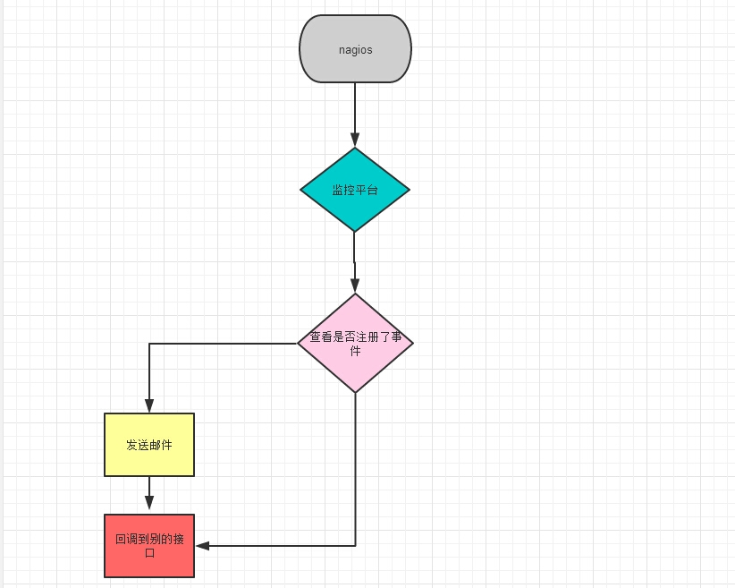
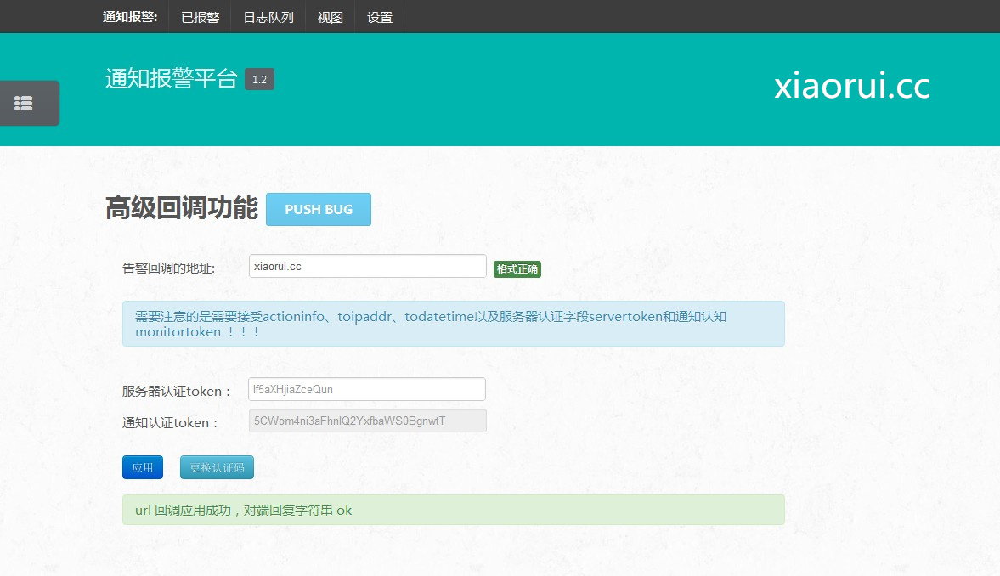
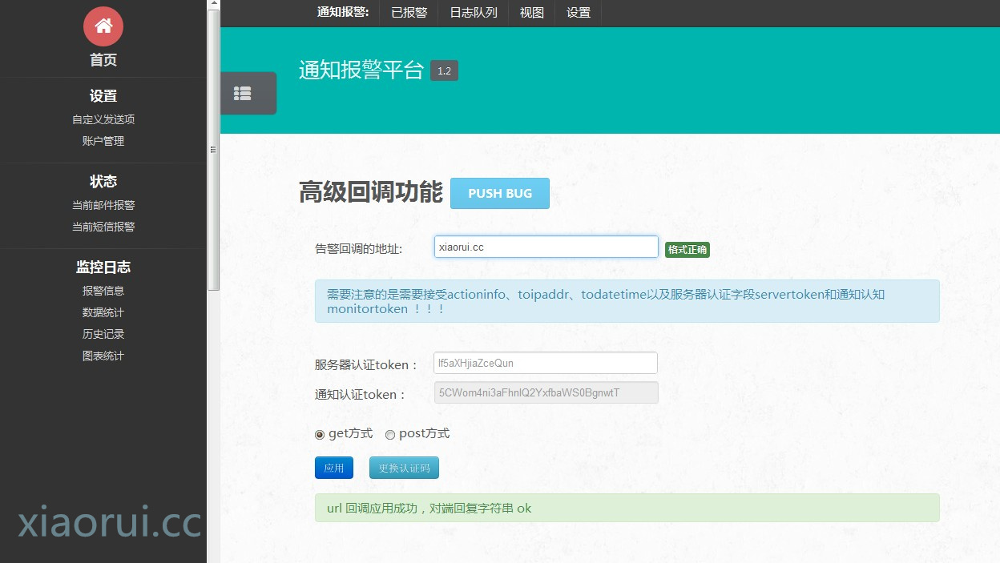
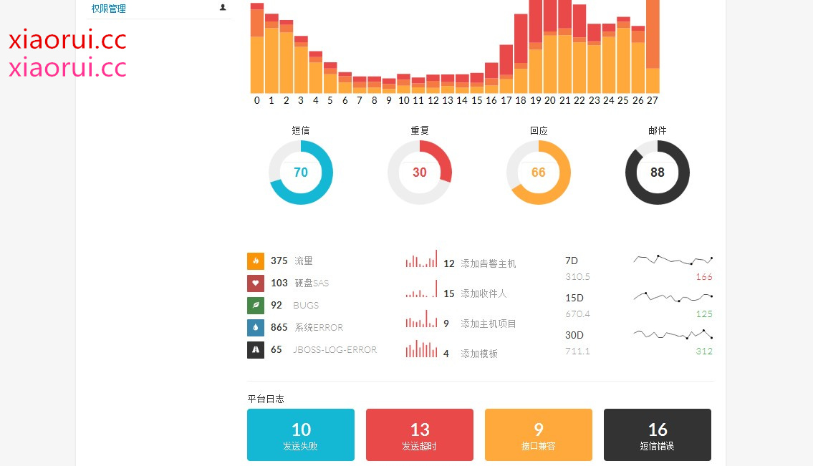
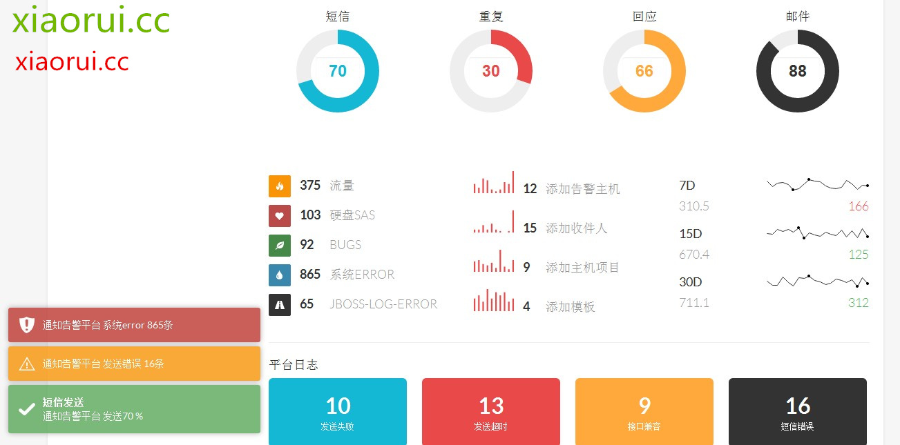

# 报警监控平台扩展功能 url 回调的设计及应用 [python 语言]

## 前言：

这个国内也有一些第三方的厂商在用，比如 dnspod 的 url 回调和监控宝的 url 回调！

有人开源了一个脚本，监控宝的 url 回调，可以联合 dnspod 的 api 接口。可以处理当 ip-A 的 web 死掉的时候，dns 记录切换到 ip-B 上。 当然这只是个小应用罢了，但不能不说，这个想法确实不错。 我这边也实现了类似方式。

所谓的 URL 回调功能，您可以让告警通知发送到您指定的 URL，使你能更加灵活处理告警消息。 打个比方，有个服务器的 nginx 进程死掉了，这个时候 nagios 监控到了这个情况，然后调用了我这边的接口，我这边接到的 post 数据，不仅发邮件，而且会根据注册事件的情况，进行处理。 如果注册了一个远程 nginx 重启的事项，我这边就远程 paramiko 或者是 saltstack 过去重启该进程 ！！！

## 怎么个灵活法：

每个业务部门其实都想自己统计 error 情况，但是监控平台一般是在基础监控部门手里掌控者，又不太方便做部署，这个时候，url 回调是个好方法。我会把每次告警的信息不仅推到你的 mail 和手机上，而且会给你的 url 地址做 webhook。你服务端接受认证后的 url 地址后，会有相应的措施，比如调用 saltsatck 来进行处理特定的主机，比如插入到库里面，自己做报表统计，根据来着的信息做自动化处理。

## 关于触发式的处理：

只是个人的想法而已 ~

在监控系统的体系下，比如有 nagios，zabbix 专业监控系统。 咱们还是用例子说话：  监控 mysql 从是否高延迟，严重不同步问题的时候，咱们一般是在 nagios 里加载监控获取判断从延迟的脚本，以及在某个节点上做处理脚本【脚本的内容是 while get 每个 mysql 从情况，高延迟的那台在负载群里面踢出去】，这样算的话是两个脚本了。

如果利用 url 回调，可以用处理脚本，这个脚本也只是当触发 url 回调的时候，才执行才处理的。避免了处理脚本没完没了的去判断和获取状态。要是监控一些统计压力大的服务，那就有点悲催了。

当然这样也会有些问题的，比如 web 死掉的话，他无法接受 url 回调，另一方面 开发部也不想调用系统层面的外部命令，毕竟责任是个问题。

下面是我写的 url 回调的 demo，等有机会上线供大神们测试下。

第一版的时候，没有定义 post 的方式，以及回调结果的查看。

第二版做了，get 和 post 的方式，返回结果的验证。

下面是平台的 demo ~ 我想说的是，现在好多公司的告警信息都没有统计，随意的调用 smtp 发邮件，而不知道发送成功了没有，每个月发送了几次，发送都是啥内容。当然这些东西在 nagios zabbix 也大体可以看到，但是个人觉得还是综合到一个管理系统下，管理系统更加直观。

也有想这么搞的朋友直接提问题就行，我会第一时间给大家解答~

框架：  
nginx  tornado  jquery  

此文接上文： <http://rfyiamcool.blog.51cto.com/1030776/1332160>

有后文，会补上的～

本文出自 “峰云，就她了。” 博客，谢绝转载！