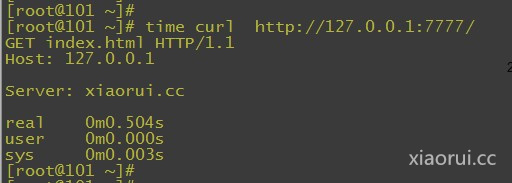
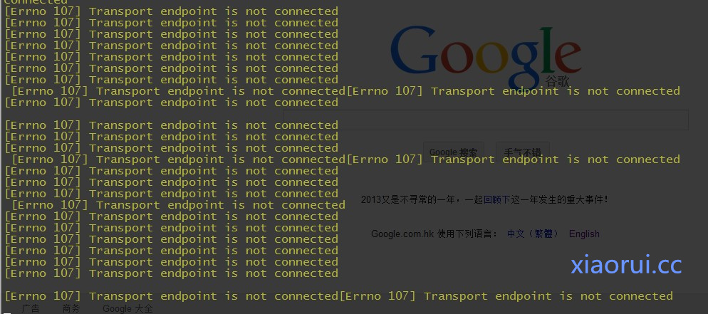
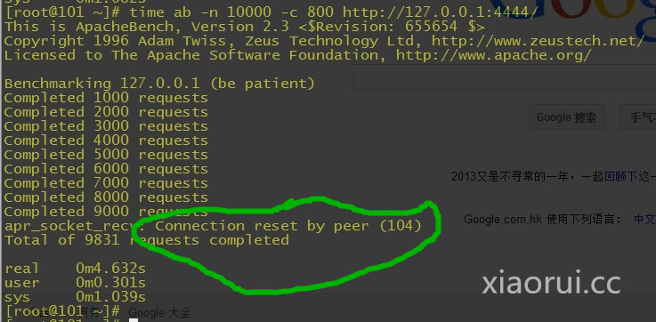
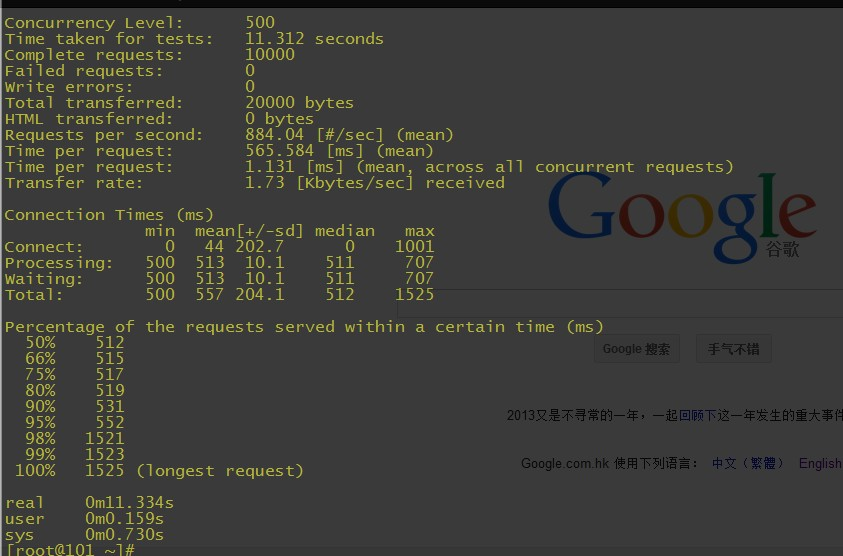
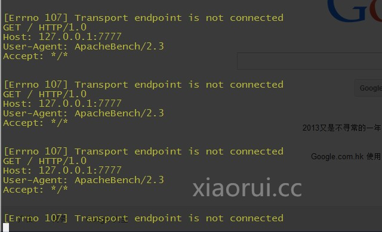

# 服务端 socket 开发之多线程和 gevent 框架并发测试[python 语言]

测试下多线程和 gevent 在 socket 服务端的小包表现能力，测试的方法不太严谨，有点属于自娱自乐，要是有问题之处，请大家喷之！

每个连接都特意堵塞了 0.5 秒钟！



在大批量 tcp 测试下，threading 的开销越来越大，所以造成了在并发数加大的情况下，出现 threading 崩溃的情况！gevent 是 libevent 和协程的融合，一个线程里面都可以跑超多的协程！ 利用 libevent 做 io 堵塞的调度，gevent 体系下，同一时间只有一个任务在运行！    

先来测试下多线程：   我们就不加线程池了

```
#!/usr/bin/env python
# -*- coding: utf-8 -*-
#xiaorui.cc
import sys
import socket
import time
import threading
#xiaorui.cc
def threads(port):
    s = socket.socket()
    s.bind(('0.0.0.0', port))
    s.listen(500)
    while True:
        cli, addr = s.accept()
        t = threading.Thread(target=handle_request, args=(cli, time.sleep))
        t.daemon = True
        t.start()
def handle_request(s, sleep):
    try:
        s.recv(1024)
        sleep(0.5)                                                                                                           
        s.send('''http/1.0 200 OK
                  Hello World! ''')
        s.shutdown(socket.SHUT_WR)
        print '.',
    except Exception, ex:
        print ex
    finally:
        sys.stdout.flush()
        s.close()
if __name__ == '__main__':
    threads(4444)
```

用 threading 跑 socket，每个连接堵塞的时间是 0.5

```
time ab -n 10000 -c 500 http://127.0.0.1:4444/
This is ApacheBench, Version 2.3 <$Revision: 655654 $>
Copyright 1996 Adam Twiss, Zeus Technology Ltd, http://www.zeustech.net/
Licensed to The Apache Software Foundation, http://www.apache.org/
Benchmarking 127.0.0.1 (be patient)
Completed 1000 requests
Completed 2000 requests
Completed 3000 requests
Completed 4000 requests
Completed 5000 requests
Completed 6000 requests
Completed 7000 requests
Completed 8000 requests
Completed 9000 requests
Completed 10000 requests
Finished 10000 requests
Server Software:
Server Hostname:        127.0.0.1
Server Port:            4444
Document Path:          /
Document Length:        0 bytes
Concurrency Level:      500
Time taken for tests:   11.123 seconds
Complete requests:      10000
Failed requests:        0
Write errors:           0
Total transferred:      470000 bytes
HTML transferred:       0 bytes
Requests per second:    899.01 [#/sec] (mean)
Time per request:       556.166 [ms] (mean)
Time per request:       1.112 [ms] (mean, across all concurrent requests)
Transfer rate:          41.26 [Kbytes/sec] received
Connection Times (ms)
              min  mean[+/-sd] median   max
Connect:        0   33 177.0      0    1000
Processing:   500  508  33.9    501    1132
Waiting:      500  508  33.9    501    1132
Total:        500  541 201.8    501    2132
Percentage of the requests served within a certain time (ms)
  50%    501
  66%    501
  75%    502
  80%    505
  90%    522
  95%    532
  98%   1534
  99%   1722
 100%   2132 (longest request)
real    0m11.145s
user    0m0.210s
sys     0m0.961s
```



加到 800 的时候~



gevent：

```
#xiaorui.cc
import sys
import socket
import time
import gevent
from gevent import socket
def server(port):
    s = socket.socket()
    s.bind(('0.0.0.0', port))
    s.listen(500)
    while True:
        cli, addr = s.accept()
        gevent.spawn(handle_request, cli, gevent.sleep)
def handle_request(s, sleep):
    try:
        data=s.recv(1024)
        sleep(0.5)
        s.send('''http/1.0 200 OK
                  Hello World! this is xiaorui.cc !!!''')
        print data
        request_string = "GET %s HTTP/1.1\r\nHost: %s\r\n\r\nServer: xiaorui.cc\n" %('index.html', '127.0.0.1')             
        s.send(request_string)
        s.shutdown(socket.SHUT_WR)
        print '.',‘be killed’
    except Exception, ex:
        print ex
    finally:
                                                                                                                                                                                                                                                                                                                                                                                   
        s.close()
if __name__ == '__main__':
    server(7777)
```

gevent 跑 socket 服务：

并发数值是 500 的时候！

```
time ab -n 10000 -c 500 http://127.0.0.1:7777/
This is ApacheBench, Version 2.3 <$Revision: 655654 $>
Copyright 1996 Adam Twiss, Zeus Technology Ltd, http://www.zeustech.net/
Licensed to The Apache Software Foundation, http://www.apache.org/
Benchmarking 127.0.0.1 (be patient)
Completed 1000 requests
Completed 2000 requests
Completed 3000 requests
Completed 4000 requests
Completed 5000 requests
Completed 6000 requests
Completed 7000 requests
Completed 8000 requests
Completed 9000 requests
Completed 10000 requests
Finished 10000 requests
Server Software:
Server Hostname:        127.0.0.1
Server Port:            7777
Document Path:          /
Document Length:        0 bytes
Concurrency Level:      500
Time taken for tests:   11.312 seconds
Complete requests:      10000
Failed requests:        0
Write errors:           0
Total transferred:      20000 bytes
HTML transferred:       0 bytes
Requests per second:    884.04 [#/sec] (mean)
Time per request:       565.584 [ms] (mean)
Time per request:       1.131 [ms] (mean, across all concurrent requests)
Transfer rate:          1.73 [Kbytes/sec] received
Connection Times (ms)
              min  mean[+/-sd] median   max
Connect:        0   44 202.7      0    1001
Processing:   500  513  10.1    511     707
Waiting:      500  513  10.1    511     707
Total:        500  557 204.1    512    1525
Percentage of the requests served within a certain time (ms)
  50%    512
  66%    515
  75%    517
  80%    519
  90%    531
  95%    552
  98%   1521
  99%   1523
 100%   1525 (longest request)
real    0m11.334s
user    0m0.159s
sys     0m0.730s
```



服务端看到的信息都是正常的！


并发是 1000 的时候：

```
time ab -n 10000 -c 1000 http://127.0.0.1:7777/
This is ApacheBench, Version 2.3 <$Revision: 655654 $>
Copyright 1996 Adam Twiss, Zeus Technology Ltd, http://www.zeustech.net/
Licensed to The Apache Software Foundation, http://www.apache.org/
Benchmarking 127.0.0.1 (be patient)
Completed 1000 requests
Completed 2000 requests
Completed 3000 requests
Completed 4000 requests
Completed 5000 requests
Completed 6000 requests
Completed 7000 requests
Completed 8000 requests
Completed 9000 requests
Completed 10000 requests
Finished 10000 requests
Server Software:
Server Hostname:        127.0.0.1
Server Port:            7777
Document Path:          /
Document Length:        0 bytes
Concurrency Level:      1000
Time taken for tests:   7.406 seconds
Complete requests:      10000
Failed requests:        0
Write errors:           0
Total transferred:      20000 bytes
HTML transferred:       0 bytes
Requests per second:    1350.22 [#/sec] (mean)
Time per request:       740.623 [ms] (mean)
Time per request:       0.741 [ms] (mean, across all concurrent requests)
Transfer rate:          2.64 [Kbytes/sec] received
Connection Times (ms)
              min  mean[+/-sd] median   max
Connect:        0  175 491.7      0    3000
Processing:   500  520  17.7    515     707
Waiting:      500  520  17.7    515     707
Total:        500  695 492.5    517    3521
Percentage of the requests served within a certain time (ms)
  50%    517
  66%    523
  75%    538
  80%    569
  90%   1515
  95%   1530
  98%   1539
  99%   3514
 100%   3521 (longest request)
real    0m7.428s
user    0m0.208s
sys     0m0.741s
```

当并发到 1500 的时候：

```
time ab -n 10000 -c 1500 http://127.0.0.1:7777/
This is ApacheBench, Version 2.3 <$Revision: 655654 $>
Copyright 1996 Adam Twiss, Zeus Technology Ltd, http://www.zeustech.net/
Licensed to The Apache Software Foundation, http://www.apache.org/
Benchmarking 127.0.0.1 (be patient)
Completed 1000 requests
Completed 2000 requests
Completed 3000 requests
Completed 4000 requests
Completed 5000 requests
Completed 6000 requests
Completed 7000 requests
Completed 8000 requests
Completed 9000 requests
Completed 10000 requests
Finished 10000 requests
Server Software:
Server Hostname:        127.0.0.1
Server Port:            7777
Document Path:          /
Document Length:        0 bytes
Concurrency Level:      1500
Time taken for tests:   5.290 seconds
Complete requests:      10000
Failed requests:        0
Write errors:           0
Total transferred:      20000 bytes
HTML transferred:       0 bytes
Requests per second:    1890.27 [#/sec] (mean)
Time per request:       793.536 [ms] (mean)
Time per request:       0.529 [ms] (mean, across all concurrent requests)
Transfer rate:          3.69 [Kbytes/sec] received
Connection Times (ms)
              min  mean[+/-sd] median   max
Connect:        0  214 404.9      1    1003
Processing:   500  522  23.0    514     716
Waiting:      500  522  23.0    514     716
Total:        500  736 406.7    520    1712
Percentage of the requests served within a certain time (ms)
  50%    520
  66%    558
  75%    602
  80%   1506
  90%   1526
  95%   1531
  98%   1535
  99%   1548
 100%   1712 (longest request)
real    0m5.313s
user    0m0.275s
sys     0m0.763s
```

出现了少量的报错：



gevent 可以加个队列，来限制协程的数目，但是数目限制了，虽然稳定了，但是并发数上不去。

```
from gevent.pool import Pool
pool = Pool(N)
```

这里测试有点简单，虽然已经安排了连接的堵塞，但是毕竟不符合业务。 有时间把后端的任务改成才 mongodb 取数据 ！

本文出自 “峰云，就她了。” 博客，谢绝转载！