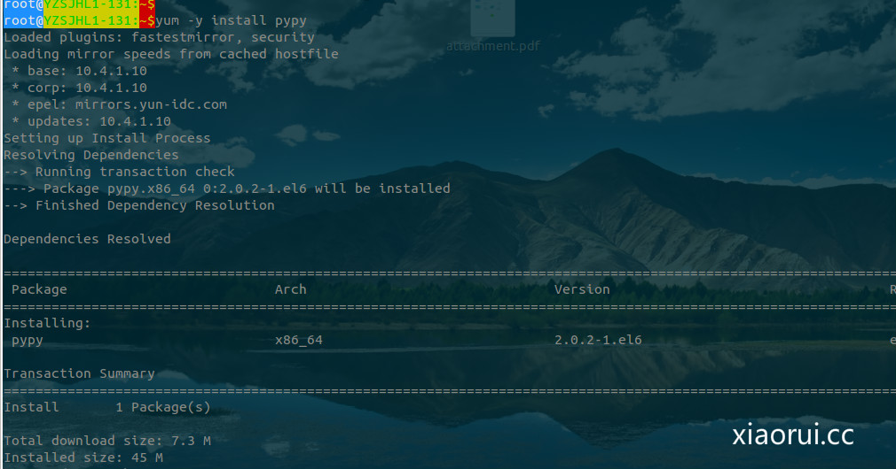
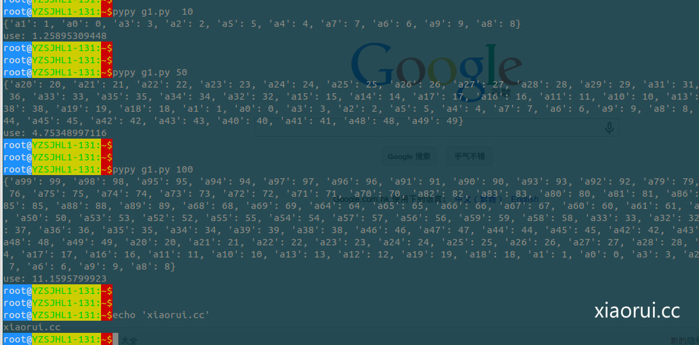
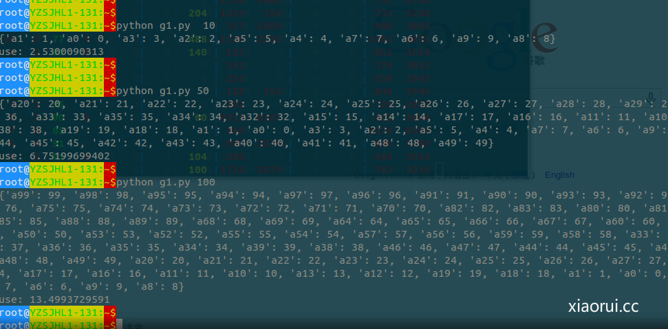
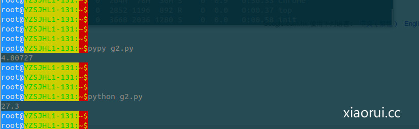
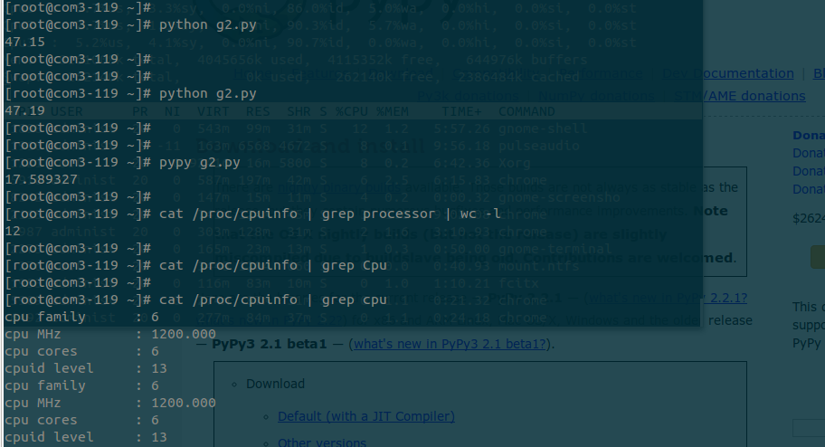

# 利用 pypy 提高 python 脚本的执行速度及测试性能

## 啥是 pypy

简单地说, PyPy 是用 Python 语言写了一个工具, 将 Python 代码成 C, .NET, Java 等语言和平台的代码. PHP 也有类似的项目 – HipHop-PHP, 把 PHP 代码转成 C++ 代码.

为什么要将一种语言转成另一种语言? 首先是目标语言可能在性能(如 C 语言)和/或跨平台(如 .NET, Java)等方面具有优势. 其次, 在转换的过程, 可以进行代码优化或加入新技术, 比如 PyPy 应用的 Just-in-Time(JIT) 技术, 能让 Python (事实上是转换后的目标代码)的执行速度更快.

反正是性能很好的东西，但是也有不少的局限性。

咱们就不用源码安装了，最新的版本是 2.2.1，但是看老外那边用 2.0 的还是比较的多。 有需要的朋友可以下载 2.2.1

地址：<http://pypy.org/download.html>



简单的跑一下：

```
import time
#xiaorui.cc
#rfyiamcool@163.com
def test(n,m):
    m=m
    vals = []
    keys = []
    for i in xrange(m):
        vals.append(i)
        keys.append('a%s'%i)
    d = None
    for i in xrange(n):
        d = dict(zip(keys, vals))
    return d
if __name__ == '__main__':
    st = time.time()
    print test(1000000,100)
    print 'use:', time.time() - st
```

看看 pypy 和纯 python 执行的效率比较！

发现一个小规律，在小数据的时候，貌似 pypy 比率很大，但是运算多了后，貌似结果差距不算大。



这是用纯 python 执行的结果。



```
import time
from time import clock
#xiaorui.cc
def check(num):
    a = list(str(num))
    b = a[::-1]
    if a == b:
        return True
    return False
                                                                                                                                                                                                                                                                                       
                                                                                                                                                                                                                                                                                       
def main():
    all = range(1,10**7)
    for i in all:
        if check(i):
            if check(i**2):
                print(i,i**2)
                                                                                                                                                                                                                                                                                       
                                                                                                                                                                                                                                                                                       
if __name__ == '__main__':
    start = clock()
    main()
    end = clock()
    print (end-start)
```



结果打出来是这样的 ～

```
root@YZSJHL1-131:~$python g2.py
(1, 1)
(2, 4)
(3, 9)
(11, 121)
(22, 484)
(101, 10201)
(111, 12321)
(121, 14641)
(202, 40804)
(212, 44944)
(1001, 1002001)
(1111, 1234321)
(2002, 4008004)
(10001, 100020001)
(10101, 102030201)
(10201, 104060401)
(11011, 121242121)
(11111, 123454321)
(11211, 125686521)
(20002, 400080004)
(20102, 404090404)
(100001, 10000200001)
(101101, 10221412201)
(110011, 12102420121)
(111111, 12345654321)
(200002, 40000800004)
(1000001, 1000002000001)
(1001001, 1002003002001)
(1002001, 1004006004001)
(1010101, 1020304030201)
(1011101, 1022325232201)
(1012101, 1024348434201)
(1100011, 1210024200121)
(1101011, 1212225222121)
(1102011, 1214428244121)
(1110111, 1232346432321)
(1111111, 1234567654321)
(2000002, 4000008000004)
(2001002, 4004009004004)
```

不知道是不是服务器的性能不够高，找了台所谓高性能的服务器再跑跑： （公司刚买了一堆的华为服务器，挺好奇的，华为居然也出服务器了，找了台没上线的服务器测试下）

我晕，真垃圾的呀！看来这个机型适合做杂七杂八的业务的机型 ！  

python 的因为是单核跑的，所以和 cpu 的主频有关联的！



有老外说 gevent 和 pypy 可以更好的提高效率，在 pypy 层次下也可以调用协程。等有结果在分享给大家！

pypy 对我来说，最大的缺点就是他的库支持的还是少，尤其是 socket 级别的包，不少的 bug。  就算是最广泛的 Django 也是存在兼容的！  

```
root@YZSJHL1-131:~$pypy myapp.py
Traceback (most recent call last):
  File "app_main.py", line 72, in run_toplevel
  File "myapp.py", line 2, in <module>
    from flask import Flask
ImportError: No module named flask
root@YZSJHL1-131:~$
```

好，先说到这里 ！

本文出自 “峰云，就她了。” 博客，谢绝转载！