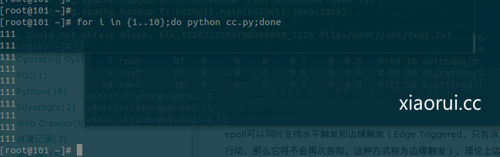

# python 实现 select 和 epoll 模型 socket 网络编程

这里简单搞搞 select 和 eopll 的接口开发 ~

select 目前几乎在所有的平台上支持，其良好跨平台支持也是它的一个优点，事实上从现在看来，这也是它所剩不多的优点之一，现在其实更多的人用 epoll，在 python 下 epoll 文档有点少，就先讲究搞搞 select ～

select 的一个缺点在于单个进程能够监视的文件描述符的数量存在最大限制，在 Linux 上一般为 1024，不过可以通过修改宏定义甚至重新编译内核的方式提升这一限制。


说点我的理解，要是用烦了多线程的网络编程，可以试试 select 的模型。

传递给 select 的参数是几个列表，分别表示读事件、写事件和错误事件。select 方法返回三个列表，其中包含满足条件的对象（读、写和异常）。

服务端的代码：

```
#coding:utf-8
import socket,select
import time
import os
#xiaorui.cc
host = "localhost"
port = 50000
s = socket.socket(socket.AF_INET,socket.SOCK_STREAM)
s.bind((host,port))
s.listen(5)
while 1:
     infds,outfds,errfds = select.select([s,],[],[],5)
     if len(infds) != 0:
        clientsock,clientaddr = s.accept()
        buf = clientsock.recv(8196)
        if len(buf) != 0:
            print (buf)
            os.popen('sleep 10').read()                                                                                                      
        clientsock.close()
#     print "no data coming"
```

客户端的代码：

```
#coding:utf-8
import socket,select
#xiaorui.cc
host = "localhost"
port = 50000
s = socket.socket(socket.AF_INET,socket.SOCK_STREAM)
s.connect((host,port))
                                                                                                                                                                                                                                                                                                                                                                                                                                                     
s.send("coming from select client")
s.close()
```



一个完成的 select 的例子：

这里有队列的概念

```
#
import select                                                                                                                                
import socket
import Queue
import time
import os
#创建 socket 套接字
server = socket.socket(socket.AF_INET,socket.SOCK_STREAM)
server.setblocking(False)
#配置参数
server.setsockopt(socket.SOL_SOCKET, socket.SO_REUSEADDR  , 1)
server_address= ('192.168.0.101',9999)
server.bind(server_address)
server.listen(10)
inputs = [server]
outputs = []
message_queues = {}
#timeout = 20
while inputs:
    print "waiting for next event"
#    readable , writable , exceptional = select.select(inputs, outputs, inputs, timeout)  最后一个是超时，当前连接要是超过这个时间的话，就会 kill
    readable , writable , exceptional = select.select(inputs, outputs, inputs)
                                                                                                                                                        
    # When timeout reached , select return three empty lists
    if not (readable or writable or exceptional) :
        print "Time out ! "
        break;
    for s in readable :
        if s is server:
            #通过 inputs 查看是否有客户端来
            connection, client_address = s.accept()
            print "    connection from ", client_address
            connection.setblocking(0)
            inputs.append(connection)
            message_queues[connection] = Queue.Queue()
        else:
            data = s.recv(1024)
            if data :
                print " received " , data , "from ",s.getpeername()
                message_queues[s].put(data)
                # Add output channel for response
                if s not in outputs:
                    outputs.append(s)
            else:
                #Interpret empty result as closed connection
                print "  closing", client_address
                if s in outputs :
                    outputs.remove(s)
                inputs.remove(s)
                s.close()
                #清除队列信息
                del message_queues[s]
    for s in writable:
        try:
            next_msg = message_queues[s].get_nowait()
        except Queue.Empty:
            print " " , s.getpeername() , 'queue empty'
            outputs.remove(s)
        else:
            print " sending " , next_msg , " to ", s.getpeername()
            os.popen('sleep 5').read()
            s.send(next_msg)
                                                                                                                                                            
    for s in exceptional:
        print " exception condition on ", s.getpeername()
        #stop listening for input on the connection
        inputs.remove(s)
        if s in outputs:
            outputs.remove(s)
        s.close()
        #清除队列信息
        del message_queues[s]
```

关于 epoll 的方面，大家可以看看这个老外的文档，写不错 ~

select 是轮询、epoll 是触发式的，所以 epoll 的效率高。

参考的文档地址：<http://scotdoyle.com/python-epoll-howto.html>

下面是用 epoll 实现一个服务端 ~

blog from xiaorui.cc

```
import socket, select
EOL1 = b'\n\n'
EOL2 = b'\n\r\n'
response  = b'HTTP/1.0 200 OK\r\nDate: Mon, 1 Jan 1996 01:01:01 GMT\r\n'
response += b'Content-Type: text/plain\r\nContent-Length: 13\r\n\r\n'
response += b'Hello, world!'
serversocket = socket.socket(socket.AF_INET, socket.SOCK_STREAM)
serversocket.setsockopt(socket.SOL_SOCKET, socket.SO_REUSEADDR, 1)
serversocket.bind(('0.0.0.0', 8080))
serversocket.listen(1)
serversocket.setblocking(0)
epoll = select.epoll()
epoll.register(serversocket.fileno(), select.EPOLLIN)
try:
   connections = {}; requests = {}; responses = {}
   while True:
      events = epoll.poll(1)
      for fileno, event in events:
         if fileno == serversocket.fileno():
            connection, address = serversocket.accept()
            connection.setblocking(0)
            epoll.register(connection.fileno(), select.EPOLLIN)
            connections[connection.fileno()] = connection
            requests[connection.fileno()] = b''
            responses[connection.fileno()] = response
         elif event & select.EPOLLIN:
            requests[fileno] += connections[fileno].recv(1024)
            if EOL1 in requests[fileno] or EOL2 in requests[fileno]:
               epoll.modify(fileno, select.EPOLLOUT)
               connections[fileno].setsockopt(socket.IPPROTO_TCP, socket.TCP_CORK, 1)
               print('-'*40 + '\n' + requests[fileno].decode()[:-2])
         elif event & select.EPOLLOUT:
            byteswritten = connections[fileno].send(responses[fileno])
            responses[fileno] = responses[fileno][byteswritten:]
            if len(responses[fileno]) == 0:
               connections[fileno].setsockopt(socket.IPPROTO_TCP, socket.TCP_CORK, 0)
               epoll.modify(fileno, 0)
               connections[fileno].shutdown(socket.SHUT_RDWR)
         elif event & select.EPOLLHUP:
            epoll.unregister(fileno)
            connections[fileno].close()
            del connections[fileno]
finally:
   epoll.unregister(serversocket.fileno())
```

Epoll 的最大好处是不会随着FD的数目增长而降低效率，在 select 中采用轮询处理，每个 fd 的处理情况，而 epoll 是维护一个队列，直接看队列是不是空就可以了。

在这里也推荐大家用 epoll 写服务端的东西，当然我自己理解的不够好，咱们多交流 ！！！

本文出自 “峰云，就她了。” 博客，谢绝转载！