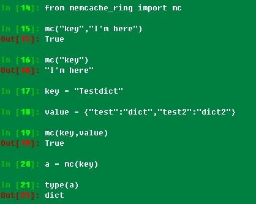
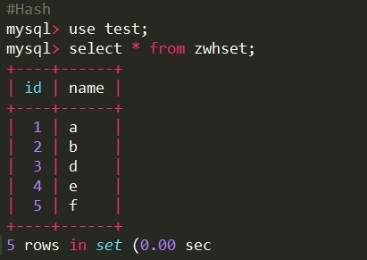
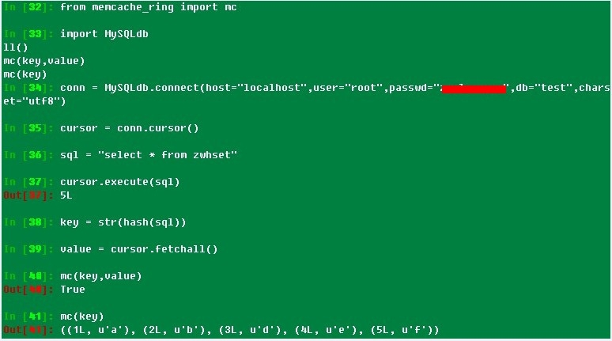

# 对 Python-memcache 分布式散列和调用的实现

煮酒品茶：对 python-memcache 进行学习，把分布式 HASH 算法加进去，不说线上自己玩玩的程序可以加到里面去。memcached 读存数据就这些东西，看着补。

分布式一致性 HASH 算法：memcache_ring.py

```
#coding:utf8
import hash_ring
import memcache
memcache_servers = [
        '127.0.0.1:11211']
weights = {
        '127.0.0.1:11211':1}
ring = hash_ring.HashRing(memcache_servers,weights)
#if value is null then get else set
def mc(key,value="Null-0"):
    server_node = ring.get_node(key)
    mc = memcache.Client([server_node],debug=1)
    if value == "Null-0":
        return mc.get(key)
    else:
        return mc.set(key,value)
```

一致性 hash 读取数据：



从数据库中读取数据

sql:





可利用起来的程序，稍改动加一些 try 之类的就可以用到自己的程序玩了。else下key =str(hash(sql))可以去掉。不知道为啥不好册。

```
#coding:utf8
from memcache_ring import mc
import MySQLdb
#如果在 memcache 中就不查数据库，不在就取出来并存一份
sql = "select * from zwhset where id=100"
key = str(hash(sql))
#查数据库
def select_sql(sql):
    conn = MySQLdb.connect(host="localhost",user="root",passwd="",db="test",charset="utf8")
    cursor = conn.cursor()
    cursor.execute(sql)
    value = cursor.fetchall()
    #如果没有查到数据，则原值返回
    if not value:
        return value
    else:
        key = str(hash(sql))
        #把存储的结果给调用程序
        return mc(key,value)
#读数据，先看 memcached里有没有，有就直接返回 memcached 查的值，没有就查数据库，
#如果数据库也返回空的话原值返回，如果有值就写 memcached,然后把 value 返回
if not mc(key):
    select_sql(sql)
else:
    mc(key)
```