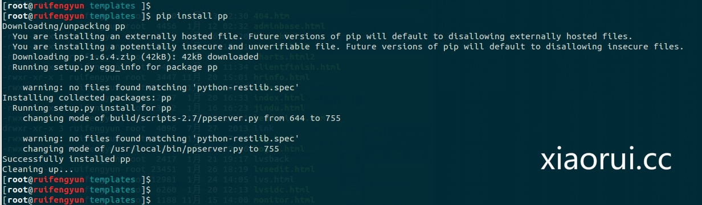
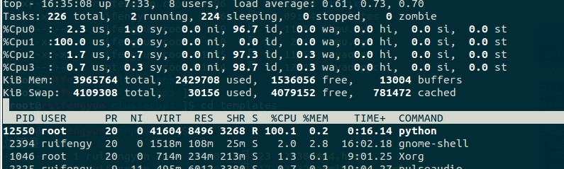
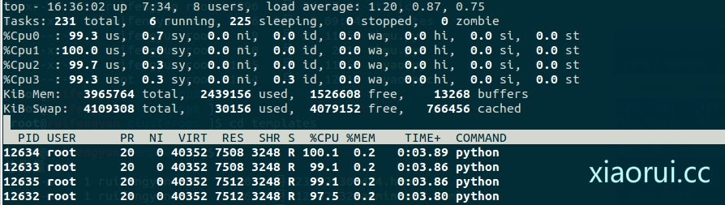
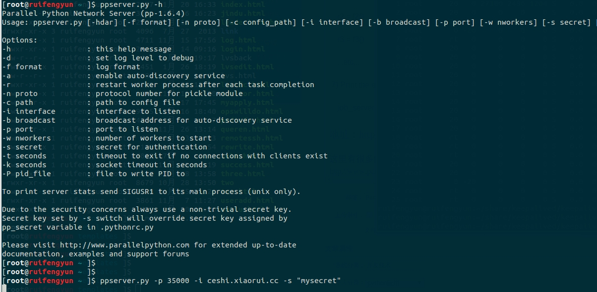

# Parallel Python 实现程序的并行多 cpu 多核利用【pp 模块】

##　为啥要这个模块：

Python　是解释型的语言,而　Python　解释器使用　GIL(全局解 释器锁)来在内部禁止并行执行,正是这个　GIL　限制你在多核处理器上同一时间也只能执行一条字节码指令. 听朋友说　python 3.0 里面已经改进, 默认有了多处理器编程的库了. Python2.XX　暂时还不支持。

Parallel Python 这个库,正是为支持　smp　多路多核多　cpu　而设计的, 而且它不仅可以多核处理器协同工作,还可以通过网络集群运行。

官网：  
<http://www.parallelpython.com/>

## pp 模块的简介

PP 是一个　Python　模块，提供了在 SMP(多 CPU 或多核)和集群(通过网络连接的多台计算机)上并行执行 Python 代码的机制。轻量级，易于安装，并 集成了其他软件。PP 也是一个用纯 Python 代码实现的跨平台，开放源码模块。

## 下面是看起来很高端的功能介绍！

* 在 SMP 和集群上并行执行 Python 代码 
* 易于理解和实现的基于工作的并行机制，便于把穿行应用转换成并行的 
* 自动构造最佳配置(默认时工作进程数量等同于系统处理器数量) 
* 动态处理器分配(允许运行时改变工作处理器数量) 
* 函数的工作缓存(透明的缓存机制确保后续调用降低负载) 
* 动态负载均衡(任务被动态的分配到各个处理器上) 
* 基于 SHA 的连接加密认证 
* 跨平台移植(Windows/Linux/Unix) 
* 开放源代码

有些朋友可能对并发和并行理解有点乱，在这里梳理下哈：

当有多个线程在操作时,如果系统只有一个 CPU,则它根本不可能真正同时进行一个以上的线程,它只能把 CPU 运行时间划分成若干个时间段,再将时间 段分配给各个线程执行,在一个时间段的线程代码运行时,其它线程处于挂起状态.这种方式我们称之为并发(Concurrent).  
当系统有一个以上 CPU 时,则线程的操作有可能非并发.当一个 CPU 执行一个线程时,另一个 CPU 可以执行另一个线程,两个线程互不抢占 CPU 资源,可以同时进行,这种方式我们称之为并行(Parallel)

地址：<http://rfyiamcool.blog.51cto.com/1030776/1357112>

## 多线程在并发和并行环境中的不同作用

在并发环境时,多线程不可能真正充分利用 CPU,节约运行时间,它只是以”挂起->执行->挂起”的方式以很小的时间片分别运行各个线程,给用户以每个线程都在运行的错觉.在这种环境中,多线程程序真正改善的是系统的响应性能和程序的友好性.  
在并行环境中, 一个时刻允许多个线程运行,这时多线程程序才真正充分利用了多 CPU 的处理能力, 节省了整体的运行时间.在这种环境中,多线程程序能体现出它的四大优势:充分利用 CPU,节省时间,改善响应和增加程序的友好性.

并发和并行的区别就是一个处理器同时处理多个任务和多个处理器或者是多核的处理器同时处理多个不同的任务。

前者是逻辑上的同时发生（simultaneous），而后者是物理上的同时发生．

来个比喻：并发和并行的区别就是一个人同时吃三个馒头和三个人同时吃三个馒头。


咱们跑一下：

安装 pp 模块



好，测试

【这是单核的利用情况下】 



开启 python 多核的情况下

【看到没有，多出了 4 个进程，这四个进程是绑在不同的 cpu上，这四个 cpu 跑的很均匀】



测试的代码：

```
#-*- coding: UTF-8 -*-
import math, sys, time
import pp
def IsPrime(n):
    """返回 n 是否是素数"""
    if not isinstance(n, int):
        raise TypeError("argument passed to is_prime is not of 'int' type")
    if n < 2:
        return False
    if n == 2:
        return True
    max = int(math.ceil(math.sqrt(n)))
    i = 2
    while i <= max:
        if n % i == 0:
            return False
        i += 1
    return True
def SumPrimes(n):
    for i in xrange(15):
        sum([x for x in xrange(2,n) if IsPrime(x)])
    """计算从 2-n 之间的所有素数之和"""
    return sum([x for x in xrange(2,n) if IsPrime(x)])
inputs = (100000, 100100, 100200, 100300, 100400, 100500, 100600, 100700)
start_time = time.time()
for input in inputs:
    print SumPrimes(input)
print '单线程执行，总耗时', time.time() - start_time, 's'
# tuple of all parallel python servers to connect with
ppservers = ()
#ppservers = ("10.0.0.1",)
if len(sys.argv) > 1:
    ncpus = int(sys.argv[1])
    # Creates jobserver with ncpus workers
    job_server = pp.Server(ncpus, ppservers=ppservers)
else:
    # Creates jobserver with automatically detected number of workers
    job_server = pp.Server(ppservers=ppservers)
print "pp 可以用的工作核心线程数", job_server.get_ncpus(), "workers"
start_time = time.time()
jobs = [(input, job_server.submit(SumPrimes,(input,), (IsPrime,), ("math",))) for input in inputs]
for input, job in jobs:
    print "Sum of primes below", input, "is", job()
print "多线程下执行耗时: ", time.time() - start_time, "s"
job_server.print_stats()
```

pp 的官方例子给的很足，也相当的简练！

导入让 python 支持多核心的模块

1) Import pp module:

   import pp

一个实例，含有cpu的核心数目
2) Start pp execution server with the number of workers set to the number of processors in the system

   job_server = pp.Server()

可以支持网络的分布式运算！

```
# tuple of all parallel python servers to connect with
ppservers = ()
#ppservers = ("10.0.0.1",)
ncpus = int(sys.argv[1])
# Creates jobserver with ncpus workers
job_server = pp.Server(ncpus, ppservers=ppservers)
```

3) Submit all the tasks for parallel execution:  

   f1 = job_server.submit(func1, args1, depfuncs1, modules1)  

   f2 = job_server.submit(func1, args2, depfuncs1, modules1)  

   f3 = job_server.submit(func2, args3, depfuncs2, modules2)  
  ...etc...
  
4) Retrieve the results as needed:

   r1 = f1()

   r2 = f2()

   r3 = f3()

   ...etc...

刚才说了 parallet python 是支持网络的分布式运算集群的！

Advanced guide, clusters

On the nodes  

1) Start parallel python execution server on all your remote computational nodes (listen to a given port 35000,  and local network interface only, accept only connections which know correct secret):

   node-1> ./ppserver.py -p 35000 -i 192.168.0.101 -s "mysecret"

   node-2> ./ppserver.py -p 35000 -i 192.168.0.102 -s "mysecret"

   node-3> ./ppserver.py -p 35000 -i 192.168.0.103 -s "mysecret"

On the client

2) Import pp module:

   import pp

3)  Create a list of all the nodes in your cluster (computers where you've run ppserver.py)

   ppservers=("node-1:35000", "node-2:35000", "node-3:35000")

4) Start pp execution server with the number of workers set to the number of processors in the system,  list of ppservers to connect with and secret key to authorize the connection:

   job_server = pp.Server(ppservers=ppservers, secret="mysecret")

5) Submit all the tasks for parallel execution:

   f1 = job_server.submit(func1, args1, depfuncs1, modules1)

   f2 = job_server.submit(func1, args2, depfuncs1, modules1)

   f3 = job_server.submit(func2, args3, depfuncs2, modules2)
  ...etc...

6) Retrieve the results as needed:

   r1 = f1()

   r2 = f2()

   r3 = f3()

   ...etc...

7) Print the execution statistics:

   job_server.print_stats()



地址：<http://rfyiamcool.blog.51cto.com/1030776/1357112>

这里有很多的例子，大家可以跑跑！

<http://www.parallelpython.com/content/view/17/31/>

安装 python 的 pp 模块直接运行就行

本文出自 “峰云，就她了。” 博客，谢绝转载！