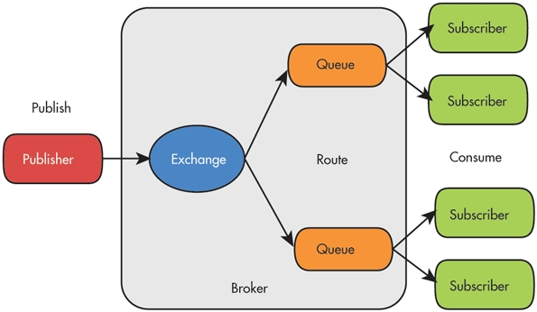
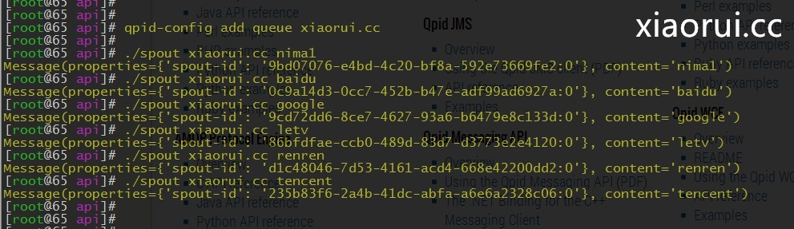
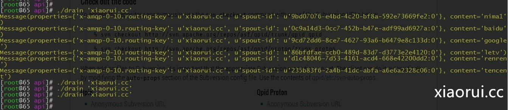
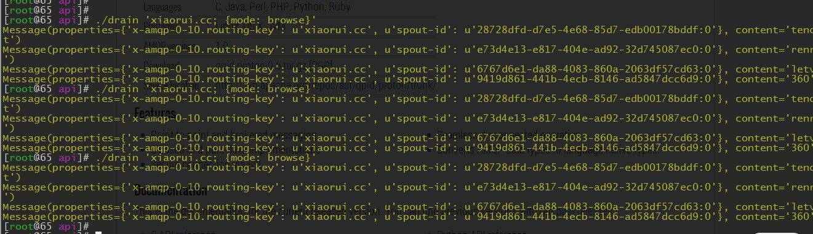
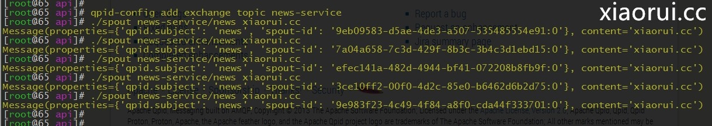
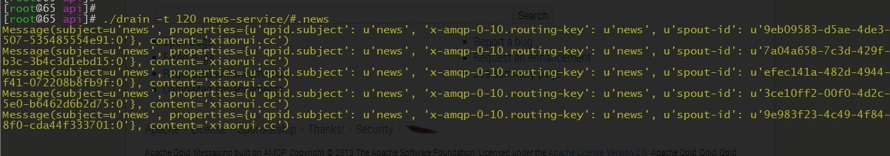

# Python 通过 amqp 消息队列协议中的 Qpid 实现数据通信

## 简介：

这两天看了消息队列通信，打算在配置平台上应用起来。以前用过 zeromq 但是这东西太快了，还有就是 rabbitmq 有点大，新浪的朋友推荐了 qpid，简单轻便。自己总结了下文档，大家可以瞅瞅。

AMQP（消息队列协议 Advanced Message Queuing Protocol）是一种消息协议 ，等同于 JMS，但是 JMS 只是 java 平台的方案，AMQP 是一个跨语言的协议。

AMQP 不分语言平台,主流的语言都支持，运维这边的 perl，python，ruby 更是支持，所以大家就放心用吧。

主流的消息队列通信类型：

```
点对点：A 发消息给 B。
广播：A 发给所有其他人的消息
组播：A 发给多个但不是所有其他人的消息。
Requester/response：类似访问网页的通信方式，客户端发请求并等待，服务端回复该请求
Pub-sub：类似杂志发行，出版杂志的人并不知道谁在看这本杂志，订阅的人并不关心谁在发表这本杂志。出版的人只管将信息发布出去，订阅的人也只在需要的时候收到该信息。
Store-and-forward：存储转发模型类似信件投递，写信的人将消息写给某人，但在将信件发出的时候，收信的人并不一定在家等待，也并不知道有消息给他。但这个消息不会丢失，会放在收信者的信箱中。这种模型允许信息的异步交换。
其他通信模型。。。
```

Publisher --->Exchange ---> MessageQueue --->Consumer

整个过程是异步的.Publisher,Consumer 相互不知道对方的存在，Exchange 负责交换/路由，依靠 Routing Key,每个消息者有一个 Routing Key，每个 Binding 将自已感兴趣的 RoutingKey 告诉 Exchange,以便 Exchange 将相关的消息转发给相应的 Queue！

## 几个概念

```
几个概念
Producer,Routing Key,Exchange,Binding，Queue,Consumer.
Producer: 消息的创建者，消息的发送者
Routing Key：唯一用来映射消息该进入哪个队列的标识
Exchange：负责消息的路由，交换
Binding:定义 Queue 和 Exchange 的映射关系
Queue：消息队列
Consumer：消息的使用者
Exchange类型
Fan-Out:类似于广播方式，不管 RoutingKey
Direct:根据 RoutingKey,进行关联投寄
Topic:类似于 Direct,但是支持多个 Key 关联，以组的方式投寄。
      key以.来定义界限。类似于 usea.news,usea.weather.这两个消息是一组的。
```



QPID

Qpid 是 Apache 开发的一款面向对象的消息中间件，它是一个 AMQP 的实现，可以和其他符合 AMQP 协议的系统进行通信。Qpid 提供了 C++/Python/Java/C# 等主流编程语言的客户端库，安装使用非常方便。相对于其他的 AMQP 实现，Qpid 社区十分活跃，有望成为标准 AMQP 中间件产品。除了符合 AMQP 基本要求之外，Qpid 提供了很多额外的 HA 特性，非常适于集群环境下的消息通信！

基本功能外提供以下特性：

采用 Corosync(?)来保证集群环境下的 Fault-tolerant(?) 特性  
支持 XML 的 Exchange,消息为 XML 时，彩用 Xquery 过滤  
支持 plugin  
提供安全认证，可对 producer/consumer 提供身份认证  
qpidd --port --no-data-dir --auth  
port:端口    
--no-data-dir:不指定数据目录  
--auth：不启用安全身份认证  

启动后自动创建一些 Exchange,amp.topic,amp.direct,amp.fanout

tools:

Qpid-config:维护 Queue,Exchange,内部配置
Qpid-route:配置 broker Federation(联盟？集群？)
Qpid-tool:监控

咱们说完介绍了，这里就赶紧测试下。

服务器端的安装：

```
yum install qpid-cpp-server
yum install qpid-tools
/etc/init.d/qpidd start
```

发布端的测试代码：



一些测试代码转自: ibm 的开发社区 

```
#!/usr/bin/env python
#xiaorui.cc
#转自 ibm 开发社区
import optparse, time
from qpid.messaging import *
from qpid.util import URL
from qpid.log import enable, DEBUG, WARN
def nameval(st):
  idx = st.find("=")
  if idx >= 0:
    name = st[0:idx]
    value = st[idx+1:]
  else:
    name = st
    value = None
  return name, value
parser = optparse.OptionParser(usage="usage: %prog [options] ADDRESS [ CONTENT ... ]",
                               description="Send messages to the supplied address.")
parser.add_option("-b", "--broker", default="localhost",
                  help="connect to specified BROKER (default %default)")
parser.add_option("-r", "--reconnect", action="store_true",
                  help="enable auto reconnect")
parser.add_option("-i", "--reconnect-interval", type="float", default=3,
                  help="interval between reconnect attempts")
parser.add_option("-l", "--reconnect-limit", type="int",
                  help="maximum number of reconnect attempts")
parser.add_option("-c", "--count", type="int", default=1,
                  help="stop after count messages have been sent, zero disables (default %default)")
parser.add_option("-t", "--timeout", type="float", default=None,
                  help="exit after the specified time")
parser.add_option("-I", "--id", help="use the supplied id instead of generating one")
parser.add_option("-S", "--subject", help="specify a subject")
parser.add_option("-R", "--reply-to", help="specify reply-to address")
parser.add_option("-P", "--property", dest="properties", action="append", default=[],
                  metavar="NAME=VALUE", help="specify message property")
parser.add_option("-M", "--map", dest="entries", action="append", default=[],
                  metavar="KEY=VALUE",
                  help="specify map entry for message body")
parser.add_option("-v", dest="verbose", action="store_true",
                  help="enable logging")
opts, args = parser.parse_args()
if opts.verbose:
  enable("qpid", DEBUG)
else:
  enable("qpid", WARN)
if opts.id is None:
  spout_id = str(uuid4())
else:
  spout_id = opts.id
if args:
  addr = args.pop(0)
else:
  parser.error("address is required")
content = None
if args:
  text = " ".join(args)
else:
  text = None
if opts.entries:
  content = {}
  if text:
    content["text"] = text
  for e in opts.entries:
    name, val = nameval(e)
    content[name] = val
else:
  content = text
conn = Connection(opts.broker,
                  reconnect=opts.reconnect,
                  reconnect_interval=opts.reconnect_interval,
                  reconnect_limit=opts.reconnect_limit)
try:
  conn.open()
  ssn = conn.session()
  snd = ssn.sender(addr)
  count = 0
  start = time.time()
  while (opts.count == 0 or count < opts.count) and \
        (opts.timeout is None or time.time() - start < opts.timeout):
    msg = Message(subject=opts.subject,
                  reply_to=opts.reply_to,
                  content=content)
    msg.properties["spout-id"] = "%s:%s" % (spout_id, count)
    for p in opts.properties:
      name, val = nameval(p)
      msg.properties[name] = val
    snd.send(msg)
    count += 1
    print msg
except SendError, e:
  print e
except KeyboardInterrupt:
  pass
conn.close()
```

客户端的测试代码：



```
#!/usr/bin/env python
#xiaorui.cc
##转自 ibm 开发社区
import optparse
from qpid.messaging import *
from qpid.util import URL
from qpid.log import enable, DEBUG, WARN
parser = optparse.OptionParser(usage="usage: %prog [options] ADDRESS ...",
                               description="Drain messages from the supplied address.")
parser.add_option("-b", "--broker", default="localhost",
                  help="connect to specified BROKER (default %default)")
parser.add_option("-c", "--count", type="int",
                  help="number of messages to drain")
parser.add_option("-f", "--forever", action="store_true",
                  help="ignore timeout and wait forever")
parser.add_option("-r", "--reconnect", action="store_true",
                  help="enable auto reconnect")
parser.add_option("-i", "--reconnect-interval", type="float", default=3,
                  help="interval between reconnect attempts")
parser.add_option("-l", "--reconnect-limit", type="int",
                  help="maximum number of reconnect attempts")
parser.add_option("-t", "--timeout", type="float", default=0,
                  help="timeout in seconds to wait before exiting (default %default)")
parser.add_option("-p", "--print", dest="format", default="%(M)s",
                  help="format string for printing messages (default %default)")
parser.add_option("-v", dest="verbose", action="store_true",
                  help="enable logging")
opts, args = parser.parse_args()
if opts.verbose:
  enable("qpid", DEBUG)
else:
  enable("qpid", WARN)
if args:
  addr = args.pop(0)
else:
  parser.error("address is required")
if opts.forever:
  timeout = None
else:
  timeout = opts.timeout
class Formatter:
  def __init__(self, message):
    self.message = message
    self.environ = {"M": self.message,
                    "P": self.message.properties,
                    "C": self.message.content}
  def __getitem__(self, st):
    return eval(st, self.environ)
conn = Connection(opts.broker,
                  reconnect=opts.reconnect,
                  reconnect_interval=opts.reconnect_interval,
                  reconnect_limit=opts.reconnect_limit)
try:
  conn.open()
  ssn = conn.session()
  rcv = ssn.receiver(addr)
  count = 0
  while not opts.count or count < opts.count:
    try:
      msg = rcv.fetch(timeout=timeout)
      print opts.format % Formatter(msg)
      count += 1
      ssn.acknowledge()
    except Empty:
      break
except ReceiverError, e:
  print e
except KeyboardInterrupt:
  pass
conn.close()
```

Browse 模式的意思是，浏览的意思，一个特殊的需求，我访问了一次，别人也能访问。

Consume 模式的意思是，我浏览了一次后，删除这一条。别人就访问不到啦。

这个是浏览模式：



sub-pub 通信的例子

Pub-sub 是另一种很有用的通信模型。恐怕它的名字就源于出版发行这种现实中的信息传递方式吧，publisher 就是出版商，subscriber 就是订阅者。

```
服务端
qpid-config add exchange topic news-service
./spout news-service/news xiaorui.cc
客户端：
./drain -t 120 news-service/#.news
```

PUB 端，创建 TOPIC 点！ 



SUB端，也就是接收端！



## 总结：

qpid 挺好用的，比 rabbitmq 要轻型，比 zeromq 保险点！ 各方面的文档也都很健全，值得一用。话说，这三个消息队列我也都用过，最一开始用的是 redis 的 pubsub 做日志收集和信息通知，后来在做集群相关的项目的时候，我自己搞了一套 zeromq 的分布式任务分发，和 saltstack 很像，当然了远没有万人用的 salt 强大。  rabbitmq 的用法，更是看中他的安全和持久化，当然性能真的不咋地。  
关于 qpid 的性能我没有亲自做大量的测试，但是听朋友说，加持久化可以到 7k，不加持久化可以到 1500 左右。

本文出自 “峰云，就她了。” 博客，谢绝转载！