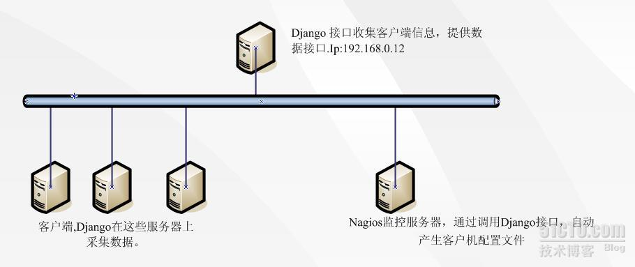
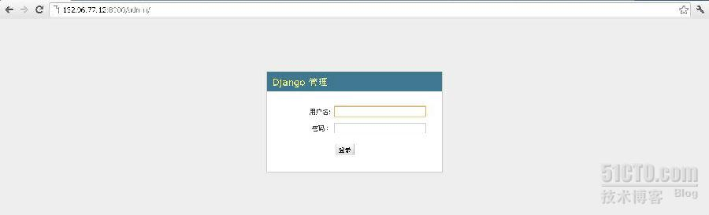
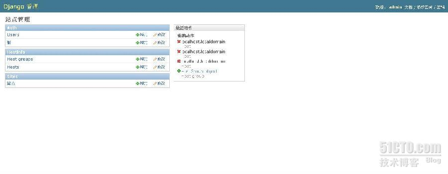

# python+Django 实现 Nagios 自动化添加监控项目

最近机房刚上了一批机器(有 100 台左右)，需要使用 Nagios 对这一批机器进行监控。领导要求两天时间完成所有主机的监控。从原来的经验来看，两天时间肯定完成不了。那怎么办？按照之前的想法，肯定是在 nagios 配置文件逐一添加每台客户端的监控信息，工作量巨大。突然，想到一个想法，是否可以通过脚本来实现批量对主机进行监控，也就是运维自动化。

写脚本，最重要的就是思路。思路压倒一切，经过思考最终决定就这么做了。先贴出来一张网路拓扑图：  

 

整个过程可以分为三部分。

- cmdb 端:主要用来实现对数据的收集，采用两个 API，一个是提供给客户机的 API。用于将客户端的数据上传的 cmdb 服务器；另外一 个 API 是 nagios 通过此 API 可以得到要监控主机的信息，然后对该信息进行整理，做成 nagios 监控模板。
- Client 端：通过 Python 脚本收集本机器要监控的软硬件信息，然后通过 cmdb 端提供的 API 接口将数据上传到 cmdb 端的数据库。
- Nagios 端：通过 cmdb 端提供的 API 接口实现对 cmdb 收集到的信息进行抓取，然后将数据写入到模板，最后 copy 到 naigos 指定的 objects 目录，最终实现对客户机的监控。

这三部分最重要的应该是 CMDB 端。接下来通过安装 django 和编写 API 接口实现 cmdb 可以正常工作。可以将 cmdb 端分为三个步骤来完成：

- 安装 django
- 配置 django
- 编写 API 接口

首先来进行安装 django：

在安装 django 之前首先应该安装 python (版本建议 2.7.)  

```
1.下载 django 软件包
  可以到 django 官方网站下载最新 django 软件包(https://www.djangoproject.com).
2.解压缩并安装软件包
   tar -zxvf Django-1.5.1.tar.gz
   cd Django-1.5.1
   python setup.py install
```

创建项目和应用：

```
1.创建一个项目
python startproject simplecmdb
2.创建一个应用
python startapp hostinfo
```

配置 django：

1.修改 setting.py

```
DATABASES = {'ENGIN':'django.db.backends.sqlite','name':path.join('CMDB.db')}  #使用的数据库及数据库名
INSTALLED_APPS =（hostinfoINSTALLED_APPS = （'hostinfo'）
INSTALLED_APPS = ('hostinfo')    #应用的名称
```

2.修改urls.py

```
url(r'^api/gethost\.json$','hostinfo.views.gethosts'),   #nagios客户端访问API接口地址
url(r'^api/clooect$','hostinfo.views.collect'),   #客户端访问API进行上传数据的API
url(r'^admin/',include(admin.site.urls)),   #django后台管理登入url
from django.contrib import admin
admin.autodiscover()
```

3.修改项目 hostinfo 下的 views.py

代码如下：  

```
# Create your views here.
#包含以下模块
from django.shortcuts import render_to_response
from django.http import HttpResponse
from models import Host, HostGroup
#包含json模块
try:
    import json
except ImportError,e:
    import simplejson as json
#用来接收客户端服务器发送过来的数据
def collect(request):
    req = request
    if req.POST:
        vendor = req.POST.get('Product_Name')
        sn = req.POST.get('Serial_Number')
        product = req.POST.get('Manufacturer')
        cpu_model = req.POST.get('Model_Name')
        cpu_num = req.POST.get('Cpu_Cores')
        cpu_vendor = req.POST.get('Vendor_Id')
        memory_part_number = req.POST.get('Part_Number')
        memory_manufacturer = req.POST.get('Manufacturer')
        memory_size = req.POST.get('Size')
        device_model = req.POST.get('Device_Model')
        device_version = req.POST.get('Firmware_Version')
        device_sn = req.POST.get('Serial_Number')
        device_size = req.POST.get('User_Capacity')
        osver = req.POST.get('os_version')
        hostname = req.POST.get('os_name')
        os_release = req.POST.get('os_release')
        ipaddrs = req.POST.get('Ipaddr')
        mac = req.POST.get('Device')
        link = req.POST.get('Link')
        mask = req.POST.get('Mask')
        device = req.POST.get('Device')
        host = Host()
        host.hostname = hostname
        host.product = product
        host.cpu_num = cpu_num
        host.cpu_model = cpu_model
        host.cpu_vendor = cpu_vendor
        host.memory_part_number = memory_part_number
        host.memory_manufacturer = memory_manufacturer
        host.memory_size = memory_size
        host.device_model = device_model
        host.device_version = device_version
        host.device_sn = device_sn
        host.device_size = device_size
        host.osver = osver
        host.os_release = os_release
        host.vendor = vendor
        host.sn = sn
        host.ipaddr = ipaddrs
        host.save()       #将客户端传过来的数据通过POST接收，存入数据库
                                                                                                                                                                                                                                                                                                                                                                                                                                                                                                                                                                                                                                                                                                                                                                                                                                                                                                                                                                                                                                                                                                                                                                                                                                             
        return HttpResponse('OK')   #如果插入成功，返回'ok'
    else:
        return HttpResponse('no post data')
#提供给NAGIOS 的API
def gethosts(req):
    d = []
    hostgroups = HostGroup.objects.all()
    for hg in hostgroups:
        ret_hg = {'hostgroup':hg.name,'members':[]}
        members = hg.members.all()
        for h in members:
            ret_h = {'hostname':h.hostname,    #API接口返回的数据
                'ipaddr':h.ipaddr
            }
            ret_hg['members'].append(ret_h)
        d.append(ret_hg)
    ret = {'status':0,'data':d,'message':'ok'}
    return HttpResponse(json.dumps(ret))
```
 
4.修改 model.py 文件

代码如下：

```
from django.db import models
# Create your models here.
#插入数据库的Host表,主要存储客户端主机的信息
class Host(models.Model):
    """store host information"""
    vendor = models.CharField(max_length=30,null=True)
    sn = models.CharField(max_length=30,null=True)
    product = models.CharField(max_length=30,null=True)
    cpu_model = models.CharField(max_length=50,null=True)
    cpu_num = models.CharField(max_length=2,null=True)
    cpu_vendor = models.CharField(max_length=30,null=True)
    memory_part_number = models.CharField(max_length=30,null=True)
    memory_manufacturer = models.CharField(max_length=30,null=True)
    memory_size = models.CharField(max_length=20,null=True)
    device_model = models.CharField(max_length=30,null=True)
    device_version = models.CharField(max_length=30,null=True)
    device_sn = models.CharField(max_length=30,null=True)
    device_size = models.CharField(max_length=30,null=True)
    osver = models.CharField(max_length=30,null=True)
    hostname = models.CharField(max_length=30,null=True)
    os_release = models.CharField(max_length=30,null=True)
    ipaddr = models.IPAddressField(max_length=15)
    def __unicode__(self):
        return self.hostname
#主机组表，用来对主机进行分组
class HostGroup(models.Model):
    name = models.CharField(max_length=30)
    members = models.ManyToManyField(Host)
```

5.修改 admin.py 文件

```
#from models import Host, IPaddr
from models import Host, HostGroup
from django.contrib import admin
#设置在django在admin后天显示的名称
class HostAdmin(admin.ModelAdmin):
    list_display = ['vendor',
        'sn',
        'product',
        'cpu_model',
        'cpu_num',
        'cpu_vendor',
        'memory_part_number',
        'memory_manufacturer',
        'memory_size',
        'device_model',
        'device_version',
        'device_sn',
        'device_size',
        'osver',
        'hostname',
        'os_release'
        ]
#在django后台amdin显示的组名称
class HostGroupAdmin(admin.ModelAdmin):
    list_display = ['name',]
#将如上两个类的数据展示到django的后台
admin.site.register(HostGroup,HostGroupAdmin)
admin.site.register(Host, HostAdmin)
```

6.创建数据库

```
   python manager.py syncdb  #创建数据库
```

7.启动应用

```
   python manager.py runserver 0.0.0.0:8000
```

8.测试

<http://132.96.77.12:8000/admin>

  
 
 

通过上图可以看到，django 已经配置成功。

接下来可以在客户端编写收集主机信息的脚本了，主要抓取 cpu、内存、硬盘、服务器型号、服务器 sn、ip 地址、主机名称、操作系统版本等信息，共 7 个脚本:
   
1.cpu 抓取脚本：

```
#!/usr/local/src/python/bin/python
#-*- coding:utf-8 -*-
from subprocess import PIPE,Popen
import re
def getCpuInfo():
    p = Popen(['cat','/proc/cpuinfo'],shell=False,stdout=PIPE)
    stdout, stderr = p.communicate()
    return stdout.strip()
def parserCpuInfo(cpudata):
    pd = {}
    model_name = re.compile(r'.*model name\s+:\s(.*)')
    vendor_id = re.compile(r'vendor_id\s+:(.*)')
    cpu_cores = re.compile(r'cpu cores\s+:\s([\d]+)')
    lines = [line for line in cpudata.split('\n')]
    for line in lines:
        model = re.match(model_name,line)
        vendor = re.match(vendor_id,line)
        cores = re.match(cpu_cores,line)
        if model:
            pd['Model_Name'] = model.groups()[0].strip()
        if vendor:
            pd['Vendor_Id'] = vendor.groups()[0].strip()
        if cores:
            pd['Cpu_Cores'] = cores.groups()[0]
        else:
            pd['Cpu_Cores'] = int('1')
    return pd
if __name__ == '__main__':
    cpudata = getCpuInfo()
    print parserCpuInfo(cpudata)
```
 
2.硬盘抓取脚本：

```
#!/usr/local/src/python/bin/python
#-*- coding:utf-8 -*-
from subprocess import PIPE,Popen
import re
def getDiskInfo():
    disk_dev = re.compile(r'Disk\s/dev/[a-z]{3}')
    disk_name = re.compile(r'/dev/[a-z]{3}')
    p = Popen(['fdisk','-l'],shell=False,stdout=PIPE)
    stdout, stderr = p.communicate()
    for i in stdout.split('\n'):
        disk = re.match(disk_dev,i)
        if disk:
            dk = re.search(disk_name,disk.group()).group()
    n = Popen('smartctl -i %s' % dk,shell=True,stdout=PIPE)
    stdout, stderr = n.communicate()
    return stdout.strip()
def parserDiskInfo(diskdata):
    ld = []
    pd = {}
    device_model = re.compile(r'(Device Model):(\s+.*)')
    serial_number = re.compile(r'(Serial Number):(\s+[\d\w]{1,30})')
    firmware_version = re.compile(r'(Firmware Version):(\s+[\w]{1,20})')
    user_capacity = re.compile(r'(User Capacity):(\s+[\d\w, ]{1,50})')
    for line in diskdata.split('\n'):
        serial = re.search(serial_number,line)
        device = re.search(device_model,line)
        firmware = re.search(firmware_version,line)
        user = re.search(user_capacity,line)
        if device:
            pd['Device_Model'] = device.groups()[1].strip()
        if serial:
            pd['Serial_Number'] = serial.groups()[1].strip()
        if firmware:
            pd['Firmware_Version'] = firmware.groups()[1].strip()
        if user:
            pd['User_Capacity'] = user.groups()[1].strip()
    return pd
if __name__ == '__main__':
    diskdata = getDiskInfo()
    print parserDiskInfo(diskdata)
```
 
3.内存抓取脚本：

```
#!/usr/local/src/python/bin/python
#-*- coding:utf-8 -*-
from subprocess import PIPE,Popen
import re
import sys
def getMemInfo():
    p = Popen(['dmidecode'],shell=False,stdout=PIPE)
    stdout, stderr = p.communicate()
    return stdout.strip()
def parserMemInfo(memdata):
    line_in = False
    mem_str = ''
    pd = {}
    fd = {}
    for line in memdata.split('\n'):
        if line.startswith('Memory Device') and line.endswith('Memory Device'):
            line_in = True
            mem_str+='\n'
            continue
        if line.startswith('\t') and line_in:
            mem_str+=line
        else:
            line_in = False
    for i in mem_str.split('\n')[1:]:
        lines = i.replace('\t','\n').strip()
        for ln in lines.split('\n'):
            k, v = [i for i in ln.split(':')]
            pd[k.strip()] = v.strip()
        if pd['Size'] != 'No Module Installed':
            mem_info = 'Size:%s  ; Part_Number:%s ; Manufacturer:%s' % (pd['Size'],pd['Part Number'],pd['Manufacturer'])
            for line in mem_info.split('\n'):
                for word in line.split(';'):
                    k, v = [i.strip() for i in word.split(':')]
                    fd[k] = v.strip()
                yield fd
if __name__ == '__main__':
    memdata = getMemInfo()
    for i in  parserMemInfo(memdata):
        print i
```

4.抓取服务器信息脚本：

```
#!/usr/local/src/python/bin/python
# -*- coding:utf-8 -*-
from subprocess import PIPE,Popen
import urllib, urllib2
def getDMI():
    p = Popen('dmidecode',shell=True,stdout=PIPE)
    stdout, stderr = p.communicate()
    return stdout
def parserDMI(dmidata):
    pd = {}
    fd = {}
    line_in = False
    for line in dmidata.split('\n'):
        if line.startswith('System Information'):
            line_in = True
            continue
        if line.startswith('\t') and line_in:
            k, v  = [i.strip() for i in line.split(':')]
            pd[k] = v
        else:
            line_in = False
    name = "Manufacturer:%s ; Serial_Number:%s ; Product_Name:%s" % (pd['Manufacturer'],pd['Serial Number'],pd['Product Name'])
    for i in name.split(';'):
        k, v = [j.strip() for j in i.split(':')]
        fd[k] = v
    return fd
if __name__ == '__main__':
    dmidata = getDMI()
    postdata = parserDMI(dmidata)
    print postdata
```

5.抓取主机信息

```
#!/usr/local/src/python/bin/python
#-*- coding:utf-8 -*-
import platform
def getHostInfo():
    pd ={}
    version = platform.dist()
    os_name = platform.node()
    os_release = platform.release()
    os_version = '%s %s' % (version[0],version[1])
    pd['os_name'] = os_name
    pd['os_release'] = os_release
    pd['os_version'] = os_version
    return pd
if __name__ == '__main__':
    print getHostInfo()
```

6.抓取 ip 地址：

```
#!/usr/local/src/python/bin/python
#-*- coding:utf-8 -*-
from subprocess import PIPE,Popen
import re
def getIpaddr():
    p = Popen(['ifconfig'],shell=False,stdout=PIPE)
    stdout, stderr = p.communicate()
    return stdout.strip()
def parserIpaddr(ipdata):
    device = re.compile(r'(eth\d)')
    ipaddr = re.compile(r'(inet addr:[\d.]{7,15})')
    mac = re.compile(r'(HWaddr\s[0-9A-Fa-f:]{17})')
    link = re.compile(r'(Link encap:[\w]{3,14})')
    mask = re.compile(r'(Mask:[\d.]{9,15})')
    for lines in ipdata.split('\n\n'):
        pd = {}
        eth_device = re.search(device,lines)
        inet_ip = re.search(ipaddr,lines)
        hw = re.search(mac,lines)
        link_encap = re.search(link,lines)
        _mask = re.search(mask,lines)
        if eth_device:
            if eth_device:
                Device = eth_device.groups()[0]
            if inet_ip:
                Ipaddr =  inet_ip.groups()[0].split(':')[1]
            if hw:
                Mac = hw.groups()[0].split()[1]
            if link_encap:
                Link = link_encap.groups()[0].split(':')[1]
            if _mask:
                Mask = _mask.groups()[0].split(':')[1]
            pd['Device'] = Device
            pd['Ipaddr'] = Ipaddr
            pd['Mac'] = Mac
            pd['Link'] = Link
            pd['Mask'] = Mask
            yield pd
if __name__ == '__main__':
    ipdata = getIpaddr()
    for i in parserIpaddr(ipdata):
        print i
```
 
7.对这些信息进行合并，并通过API形式将数据发送给cmdb端

```
#!/usr/local/src/python/bin/python
import urllib, urllib2
from cpuinfo import *
from diskinfo import *
from meminfo import *
from product import *
from hostinfo import *
from ipaddress import *
def getHostTotal():
    ld = []
    cpuinfo = parserCpuInfo(getCpuInfo())
    diskinfo = parserDiskInfo(getDiskInfo())
    for i in  parserMemInfo(getMemInfo()):
        meminfo = i
    productinfo = parserDMI(getDMI())
    hostinfo = getHostInfo()
    ipaddr = parserIpaddr(getIpaddr())
    for i in ipaddr:
        ip = i
    for k in cpuinfo.iteritems():
        ld.append(k)
    for i in diskinfo.iteritems():
        ld.append(i)
    for j in meminfo.iteritems():
        ld.append(j)
    for v in productinfo.iteritems():
        ld.append(v)
    for x in hostinfo.iteritems():
        ld.append(x)
    for y in ip.iteritems():
        ld.append(y)
    return ld
def parserHostTotal(hostdata):
    pg = {}
    for i in hostdata:
        pg[i[0]] = i[1]
    return pg
def urlPost(postdata):
    data = urllib.urlencode(postdata)
    req = urllib2.Request('http://132.96.77.12:8000/api/collect',data)
    response = urllib2.urlopen(req)
    return response.read()
if __name__ == '__main__':
    hostdata = getHostTotal()
    postdata = parserHostTotal(hostdata)
    print urlPost(postdata)
```

到目前为止，cmdb 系统已经可以将所有客户端的主机信息写入到数据库，并且可以通过 nagios 端的 API 接口直接调到数据：

<http://132.96.77.12:8000/api/gethosts.json>

 

通过图可以看到，已经成功调用到 API 接口的数据。

接下来可以在 nagios 端进行调用 API 接口的数据，对数据进行格式化。并写入文件。
 
1.nagios脚本

```
#!/opt/data/py/bin/python
#!-*- coding:utf-8 -*-
import urllib, urllib2
import json
import os
import shutil
CURR_DIR = os.path.abspath(os.path.dirname(__file__))
HOST_CONF_DIR = os.path.join(CURR_DIR,'hosts')
HOST_TMP = """define host {
    use        linux-server
    host_name  %(hostname)s
    check_command check-host-alive
    alias      %(hostname)s
    address    %(ipaddr)s
    contact_groups admins
}
"""
def getHosts():
    url = 'http://132.96.77.12:8000/api/gethosts.json'
    return json.loads(urllib2.urlopen(url).read())
def initDir():
    if not os.path.exists(HOST_CONF_DIR):
        os.mkdir(HOST_CONF_DIR)
def writeFile(f,s):
    with open(f,'w') as fd:
        fd.write(s)
def genNagiosHost(hostdata):
    initDir()
    conf = os.path.join(HOST_CONF_DIR,'hosts.cfg')
    hostconf = ""
    for hg in hostdata:
        for h in hg['members']:
            hostconf+=HOST_TMP %h
    writeFile(conf,hostconf)
    return "ok"
def main():
    result = getHosts()
    if result['status'] == 0:
        print genNagiosHost(result['data'])
    else:
        print 'Error: %s' % result['message']
    if os.path.exists(os.path.join(HOST_CONF_DIR,'hosts.cfg')):
        os.chdir(HOST_CONF_DIR)
        shutil.copyfile('hosts.cfg','/etc/nagios/objects/hosts.cfg')
if __name__ == "__main__":
    main()
```

现在已经生成 nagios 主机的配置文件，并 copy 到 nagios/objects 目录下 hosts.cfg。接下来可以测试是否 nagios 配置有问题，如果没有问题，就可以启动 nagios 服务

```
   [root@yetcomm-v2 bin]# ./nagios -v /etc/nagios/nagios.cfg
```

通过测试，nagios 没有发生错误或警告信息，现在可以启动 nagios 服务： 

``` 
   [root@yetcomm-v2 bin]# service nagios restart
```

最后，可以通过浏览器查看 nagios 的监控界面：

 

通过上图，可以看到已经将一台主机加入到监控组。由于是生产环境，所有只能拿测试服务器进行测试。其实测试环境和生产环境的代码完全一致。

本文出自 “David” 博客，请务必保留此出处 <http://davidbj.blog.51cto.com/4159484/1249757>